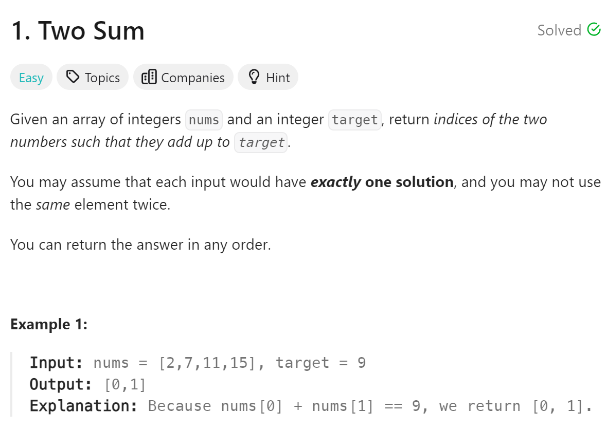

# 1 Two Sum


## 难点
没有难点

## C++
``` C++
vector<int> twoSum(vector<int>& nums, int target) {
    unordered_map<int,int> map;
    for (int i=0;i<nums.size();i++)
    {
        int tmp=target-nums[i];
        auto iter=map.find(tmp);
        if (iter!=map.end())
        {
            return {i, iter->second};
        }
        else
        {
            map.insert({nums[i],i});
        }
    }
    return {};
}
```

## Python
``` Python
def twoSum(self, nums: List[int], target: int) -> List[int]:
    map={}
    for i in range(len(nums)):
        tmp=target-nums[i]
        if tmp in map:
            return [i,map[tmp]]
        else:
            map[nums[i]]=i
    return []
```