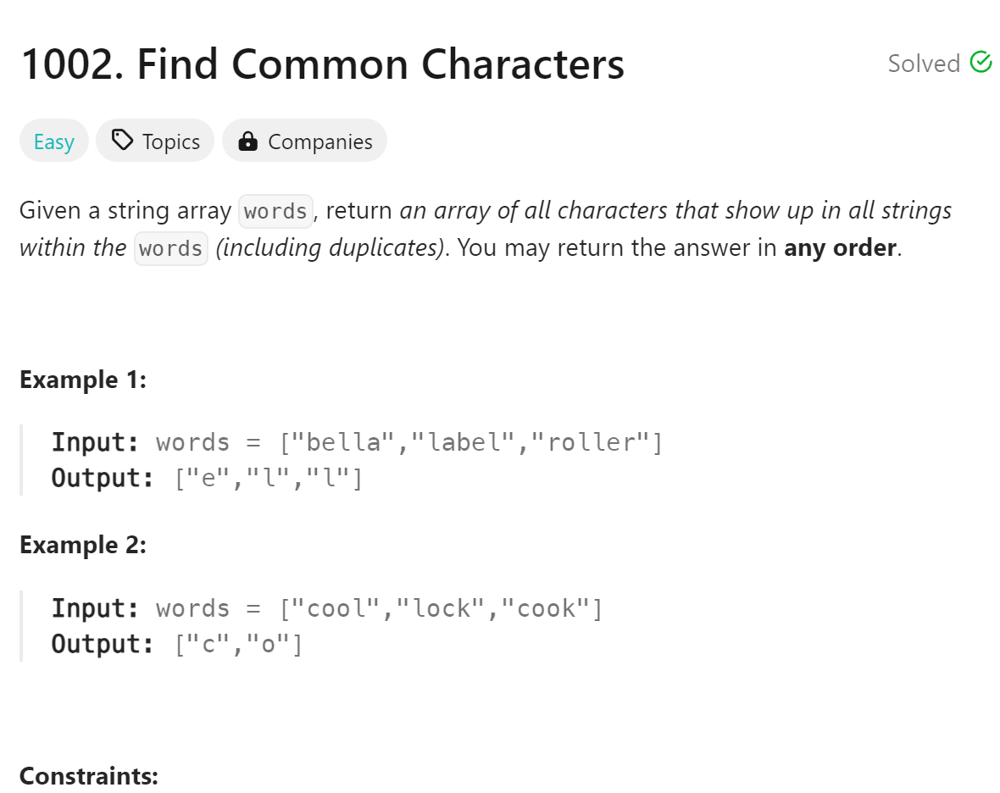

# 1002 Find Common Characters


## 难点
本题的我统计了每个单词中每个字母出现的次数，然后取最小的次数，这样能保证这是所有单词共有的字母。
难点在于python中的字母和整型的转换，要使用ord()和chr()

## C++
``` C++
vector<string> commonChars(vector<string>& words) {
    int alph[26]={0};
    for (char c: words[0])
    {
        alph[c-'a']++;
    }
    for (string str: words)
    {
        int tmp[26]={0};
        for (char c: str)
        {
            tmp[c-'a']++;
        }
        for (int i=0;i<26;i++)
        {
            alph[i]=min(alph[i],tmp[i]);
        }
    }
    vector<string> ans;
    for (int i=0;i<26;i++)
    {
        while(alph[i]--)
        {
            ans.push_back(string(1, 'a'+i));
        }
    }
    return ans;
}
```

## Python
``` Python
def commonChars(self, words: List[str]) -> List[str]:
    alph=[0]*26
    for tmp in words[0]:
        alph[ord(tmp)-ord('a')]+=1
    for word in words:
        tmp=[0]*26
        for letter in word:
            tmp[ord(letter)-ord('a')]+=1
        for i in range(26):
            alph[i]=min(alph[i],tmp[i])
    ans=[]
    for i in range(26):
        while alph[i]>0:
            ans.append(chr(ord('a')+i))
            alph[i]-=1
    return ans
```