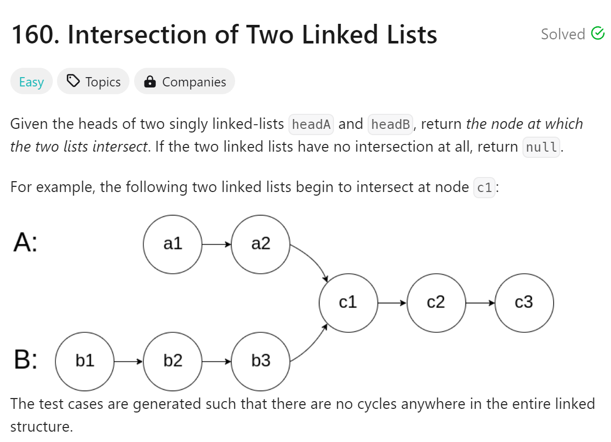

# 160 Intersection of Two Linked Lists


## 难点
注意会有没有intersection的情况

## C++
``` C++
ListNode *getIntersectionNode(ListNode *headA, ListNode *headB) {
    ListNode *p1=headA, *p2=headB;
    while(p1!=p2)
    {
        p1=p1->next;
        p2=p2->next;
        if (p1==p2) return p1;
        if (p1==nullptr) p1=headB;
        if (p2==nullptr) p2=headA;
    }
    return p1;
}
```

# Python
``` Python
def getIntersectionNode(self, headA: ListNode, headB: ListNode) -> Optional[ListNode]:
    p1, p2=headA, headB
    while p1!=p2:
        p1=p1.next
        p2=p2.next
        if p1==p2:
            return p1
        if p1==None:
            p1=headB
        if p2==None:
            p2=headA
    return p1
```