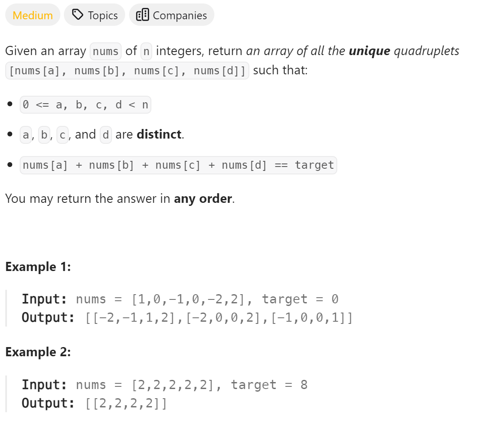

# 18 4Sum


## 难点
本题使用双指针法，难点在于去重，对每个使用过的数字要去重操作。

## C++
``` C++
vector<vector<int>> fourSum(vector<int>& nums, int target) {
    vector<vector<int>> ans;
    sort(nums.begin(),nums.end());
    for (int i=0;i<nums.size();i++)
    {
        if (i>0&&nums[i]==nums[i-1]) continue;
        for (int j=i+1;j<nums.size();j++)
        {
            if (j>i+1&&nums[j]==nums[j-1]) continue;
            int left=j+1, right=nums.size()-1;
            while(right>left)
            {
                if ((long)nums[i]+nums[j]+nums[left]+nums[right]>target)
                {
                    right--;
                }
                else if ((long)nums[i]+nums[j]+nums[left]+nums[right]<target)
                {
                    left++;
                }
                else
                {
                    ans.push_back({nums[i],nums[j],nums[left],nums[right]});
                    while(right>left&&nums[right]==nums[right-1]) right--;
                    while(right>left&&nums[left]==nums[left+1]) left++;
                    right--;
                    left++;
                }
            }
        }
    }
    return ans;
}
```