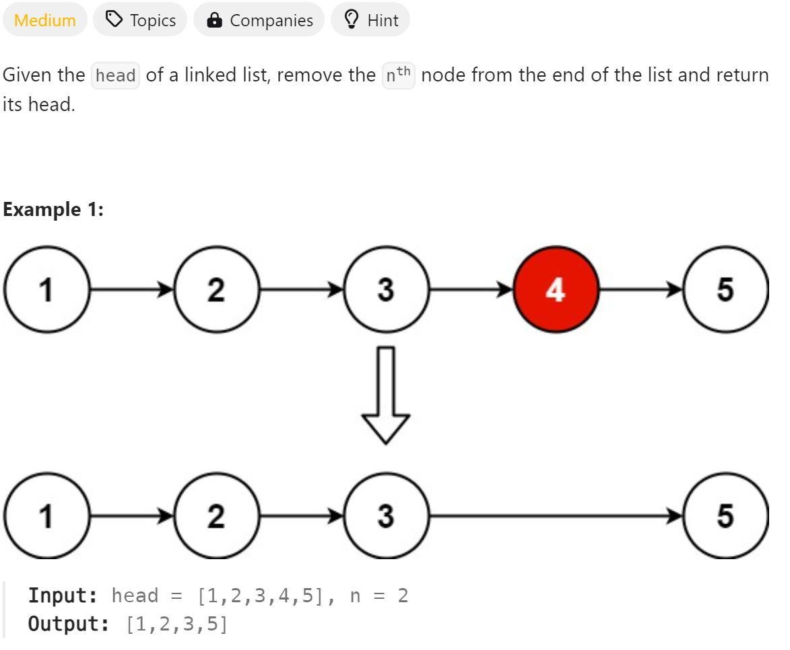

# 19 Remove Nth Node From End of List


## 难点
本题的使用双指针和虚拟链表头的做法，重点关注于移除的结点需要被delete，防止内存泄漏。

## C++
``` C++
/**
 * Definition for singly-linked list.
 * struct ListNode {
 *     int val;
 *     ListNode *next;
 *     ListNode() : val(0), next(nullptr) {}
 *     ListNode(int x) : val(x), next(nullptr) {}
 *     ListNode(int x, ListNode *next) : val(x), next(next) {}
 * };
 */
class Solution {
public:
    ListNode* removeNthFromEnd(ListNode* head, int n) {
        ListNode *Fhead= new ListNode(0,head);
        ListNode *right=head,*left=Fhead;
        while(n>1)
        {
            right=right->next;
            n--;
        }
        while(right->next!=nullptr)
        {
            right=right->next;
            left=left->next;
        }

        //remove Node
        ListNode *tmp=left->next;
        left->next=left->next->next;
        delete tmp;

        //remove dummy head
        tmp=Fhead->next;
        delete Fhead;
        return tmp;
    }
};
```

## Python
``` Python
# Definition for singly-linked list.
# class ListNode:
#     def __init__(self, val=0, next=None):
#         self.val = val
#         self.next = next
class Solution:
    def removeNthFromEnd(self, head: Optional[ListNode], n: int) -> Optional[ListNode]:
        Fhead=ListNode(0,head)
        left, right=Fhead, head
        while n>1:
            right=right.next
            n-=1
        while right.next!=None:
            right=right.next
            left=left.next
        left.next=left.next.next
        return Fhead.next
```