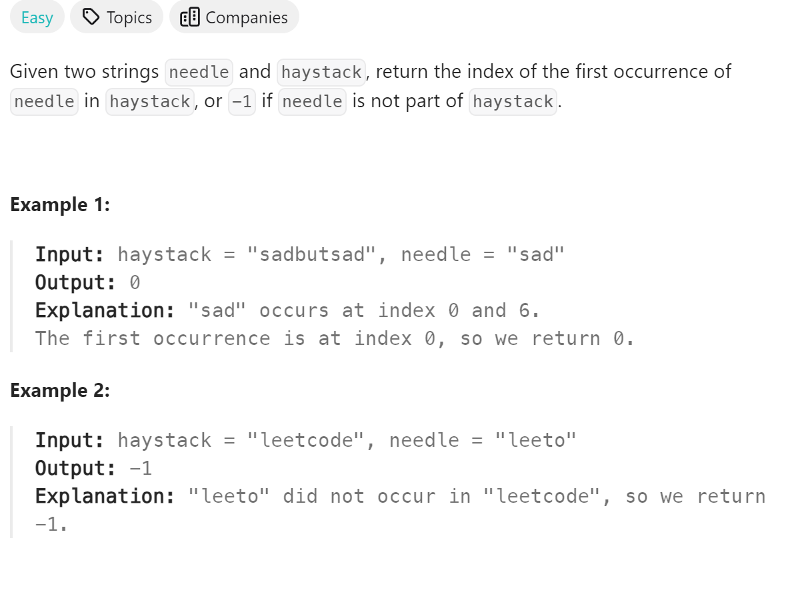

# 28. Find the Index of the First Occurrence in a String


## 难点
本题可以用内置函数，但是失去意义。所以这里我们使用kmp算法，首先算出最大相同前后缀，然后再应用kmp算法求解。

## C++
``` C++
void getNext(vector<int> &next, string s)
{
    int j=0;
    next[0]=0;
    for (int i=1;i<s.size();i++)
    {   
        while (j>0&&s[i]!=s[j])
            j=next[j-1];
        if (s[i]==s[j])
            j++;
        next[i]=j;
    }
}

int strStr(string haystack, string needle) {
    if (needle.size()==0)
        return -1;
    vector<int> next(needle.size());
    getNext(next,needle);
    int j=0;
    for (int i=0;i<haystack.size();i++)
    {
        while(j>0&&haystack[i]!=needle[j])
            j=next[j-1];
        if (haystack[i]==needle[j])
            j++;
        if (j==needle.size())
            return i-j+1;
    }
    return -1;
}
```

## Python
``` Python
class Solution:
    def getNext(self, next,s):
        j=0
        next[0]=0
        for i in range(1,len(s)):
            while j>0 and s[i]!=s[j]:
                j=next[j-1]
            if s[i]==s[j]:
                j+=1
            next[i]=j

    def strStr(self, haystack: str, needle: str) -> int:
        if len(needle)==0:
            return -1
        next=[0]*len(needle)
        j=0
        self.getNext(next, needle)
        for i in range(len(haystack)):
            while j>0 and haystack[i]!=needle[j]:
                j=next[j-1]
            if haystack[i]==needle[j]:
                j+=1
            if j==len(needle):
                return i-j+1
        return -1
```