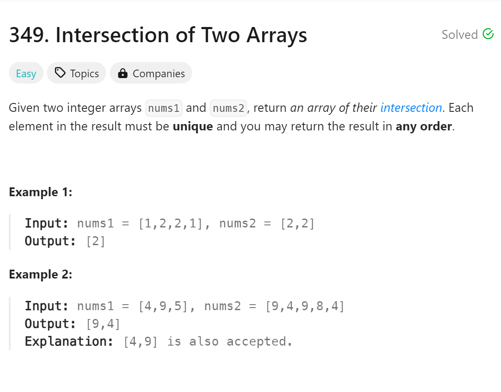

# 349 Intersection of Two Arrays


## 难点
注意python的set的运用，其内置的函数已经帮我们省去了很多步骤
注意C++中unordered_set的成员函数写法和vector不相同

## C++
``` C++
vector<int> intersection(vector<int>& nums1, vector<int>& nums2) {
    unordered_set<int> num(nums1.begin(),nums1.end());
    vector<int> ans;
    for (int i: nums2)
    {
        if (num.count(i))
        {
            ans.push_back(i);
            num.erase(i);
        }
    }
    return ans;
}
```

## Python
``` Python
def intersection(self, nums1: List[int], nums2: List[int]) -> List[int]:
    MySet1=set(nums1)
    ans=MySet1.intersection(nums2)
    return ans
```