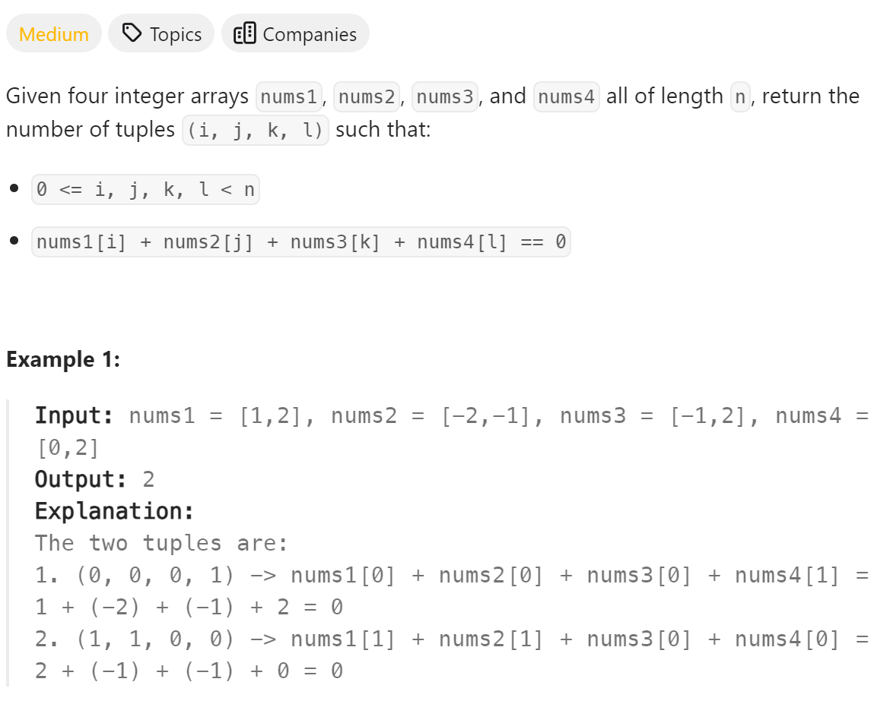

# 454 4Sum II


# 难点
本题的难点在于考虑到两数相乘+两数相乘远小于四数相乘
先将两数相加放在hashmap里，然后再对后两数相加的相反数来寻找hashmap是否有对应的key存在

## C++
``` C++
int fourSumCount(vector<int>& nums1, vector<int>& nums2, vector<int>& nums3, vector<int>& nums4) {
    unordered_map<int,int> map;
    for (int i:nums1)
        for (int j:nums2)
        {
            map[i+j]++;
        }
    int count=0;
    for (int i:nums3)
        for (int j:nums4)
        {
            if (map.find(0-i-j)!=map.end())
                count+=map[0-i-j];
        }
    return count;
}
```

## Python
``` Python
def fourSumCount(self, nums1: List[int], nums2: List[int], nums3: List[int], nums4: List[int]) -> int:
    map={}
    for i in nums1:
        for j in nums2:
            if i+j in map:
                map[i+j]+=1
            else:
                map[i+j]=1
    count=0
    for i in nums3:
        for j in nums4:
            if (0-i-j) in map:
                count+=map[0-i-j]
    return count
```