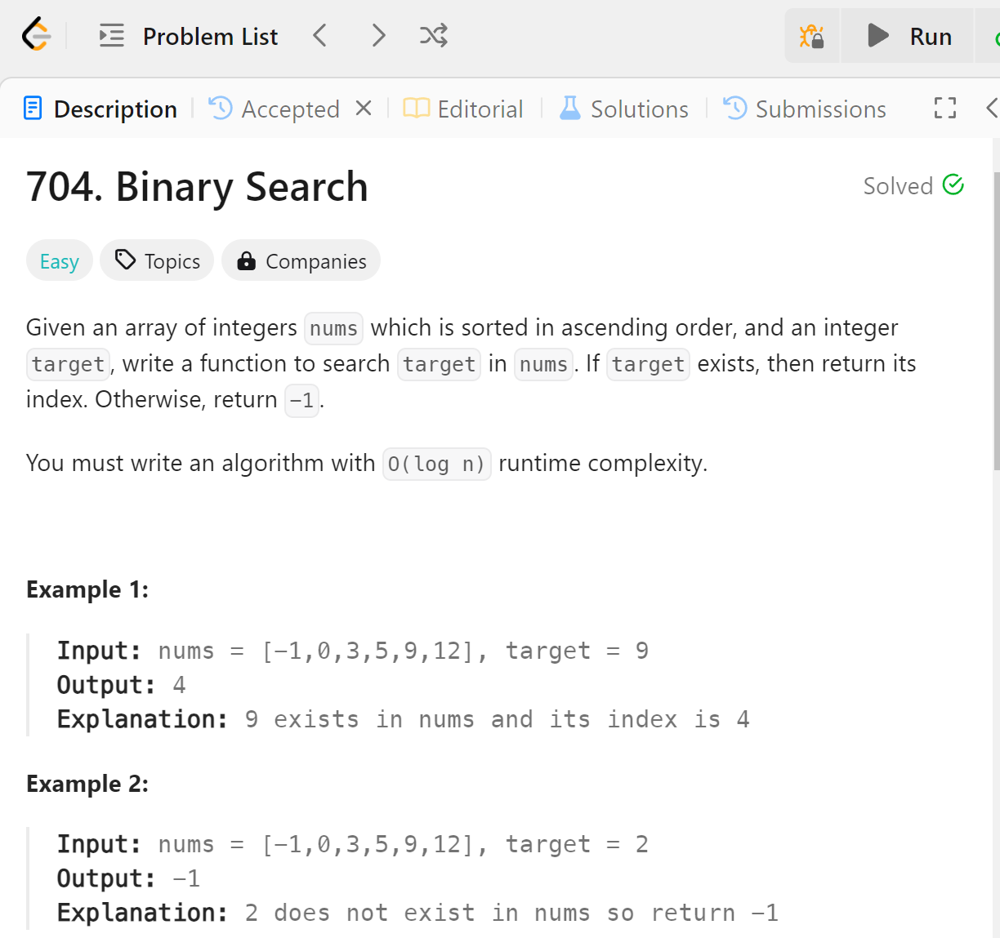

# Binary Search
## 题目

## 难点
本题的难点在于确定边界，我使用的方法是[left, right]两个闭区间，这样left=right是有效区间，需要被考虑。
同时本题也要注意涵盖临界条件，比如
[5] target=5
[2,5] target=5


## C++
```C++
    int search(vector<int>& nums, int target) {
        int right = nums.size()-1;
        int left = 0;
        while(left <= right)
        {
            int half= (left + right) /2;
            if (nums[half]==target) {
                return half;
            }
            else if (nums[half]<target){
                left=half+1;
            }
            else right=half-1;
        }
        return -1;
    }
```

## Python
```python
    def search(self, nums: List[int], target: int) -> int:
        right = len(nums)-1
        left = 0
        while left<=right:
            half=(left+right)//2
            if nums[half]==target:
                return half
            elif nums[half]<target:
                left=half+1
            else:
                right=half-1
        return -1
```