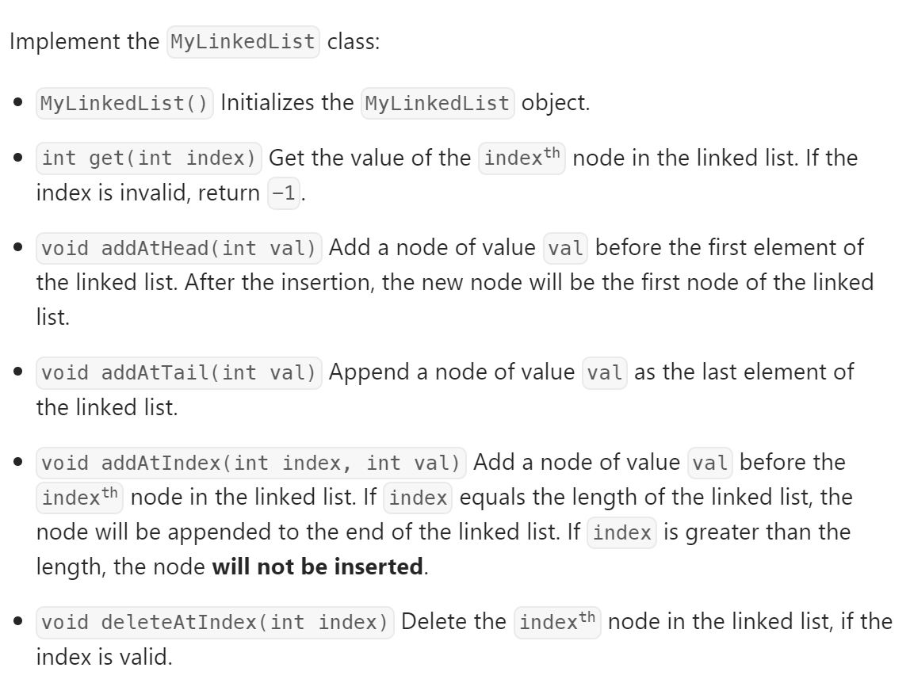

# 707 Design Linked List


## 难点
本题难点在于index和链表节点的关系，要注意是要替换index之前的节点还是index当前节点。
同时需要注意的是C++的结构体的使用方式，和Python的Class写法

## C++
``` C++
struct LinkNode
{
    int val;
    LinkNode *next;
    LinkNode(int val):val(val), next(NULL){}
};

class MyLinkedList {
public:
    LinkNode* Fhead;
    int size;
    
    MyLinkedList() {
        Fhead=new LinkNode(0);
        size=-1;
    }
    
    int get(int index) {
        if ((index>size)||(index<0)) return -1;
        LinkNode *temp=Fhead->next;
        while(index--)
        {
            temp=temp->next;
        }
        return temp->val;
    }
    
    void addAtHead(int val) {
        LinkNode* head=new LinkNode(val);
        if (Fhead->next!=NULL) 
            head->next=Fhead->next;
        Fhead->next=head;
        size++;
    }
    
    void addAtTail(int val) {
        LinkNode* tail=new LinkNode(val);
        LinkNode* temp=Fhead;
        while(temp->next!=nullptr)
        {
            temp=temp->next;
        }
        temp->next=tail;
        size++;
    }
    
    void addAtIndex(int index, int val) {
        if (index > size+1 || index < 0) {
            return;
        }
        if (index==size+1) 
        {
            this->addAtTail(val);
            return;
        }
        LinkNode* newNode=new LinkNode(val);
        LinkNode* temp=Fhead;
        while(index--)
        {
            temp=temp->next;
        }
        newNode->next=temp->next;
        temp->next=newNode;
        size++;
    }
    
    void deleteAtIndex(int index) {
        if (index > size || index < 0) {
            return;
        }
        LinkNode* temp=Fhead;
        while(index--)
        {
            temp=temp->next;
        }
        if (temp->next->next!=nullptr)
        {
            LinkNode* temp1=temp->next;
            temp->next=temp->next->next;
            delete temp1;
        }
        else
        {
            delete temp->next;
            temp->next=nullptr;
        }
        size--;
    }
};

/**
 * Your MyLinkedList object will be instantiated and called as such:
 * MyLinkedList* obj = new MyLinkedList();
 * int param_1 = obj->get(index);
 * obj->addAtHead(val);
 * obj->addAtTail(val);
 * obj->addAtIndex(index,val);
 * obj->deleteAtIndex(index);
 */
```

## Python
``` Python
class Node:
    def __init__(self,val):
        self.val=val
        self.next=None

class MyLinkedList:

    def __init__(self):
        self.head=None
        self.size=0

    def get(self, index: int) -> int:
        if index < 0 or index >= self.size:
            return -1

        current = self.head

        for _ in range(0, index):
            current = current.next

        return current.val

    def addAtHead(self, val: int) -> None:
        self.addAtIndex(0,val)

    def addAtTail(self, val: int) -> None:
        self.addAtIndex(self.size,val)

    def addAtIndex(self, index: int, val: int) -> None:
        if index>self.size or index<0:
            return
        
        cur=self.head
        newNode=Node(val)

        if index==0:
            newNode.next=cur
            self.head=newNode
        else:
            for _ in range(index-1):
                cur=cur.next
            newNode.next=cur.next
            cur.next=newNode
        self.size+=1


    def deleteAtIndex(self, index: int) -> None:
        if index < 0 or index >= self.size:
            return

        current = self.head

        if index == 0:
            self.head = self.head.next
        else:
            for _ in range(0, index - 1):
                current = current.next
            current.next = current.next.next

        self.size -= 1


# Your MyLinkedList object will be instantiated and called as such:
# obj = MyLinkedList()
# param_1 = obj.get(index)
# obj.addAtHead(val)
# obj.addAtTail(val)
# obj.addAtIndex(index,val)
# obj.deleteAtIndex(index)
```