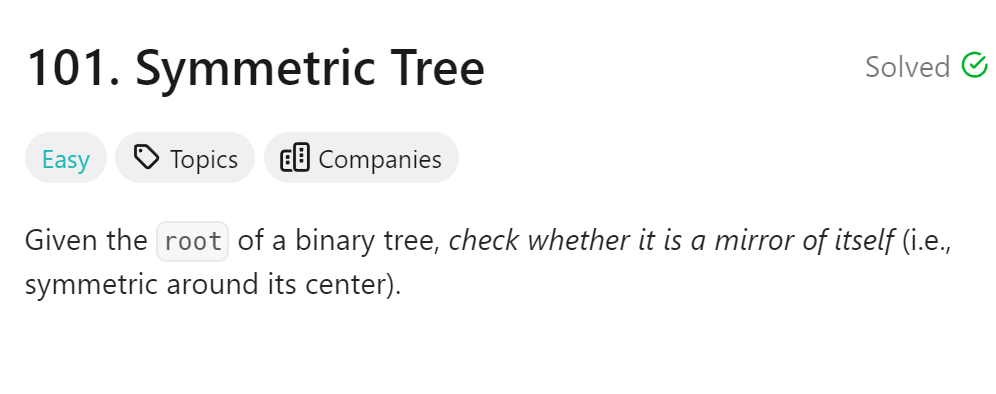
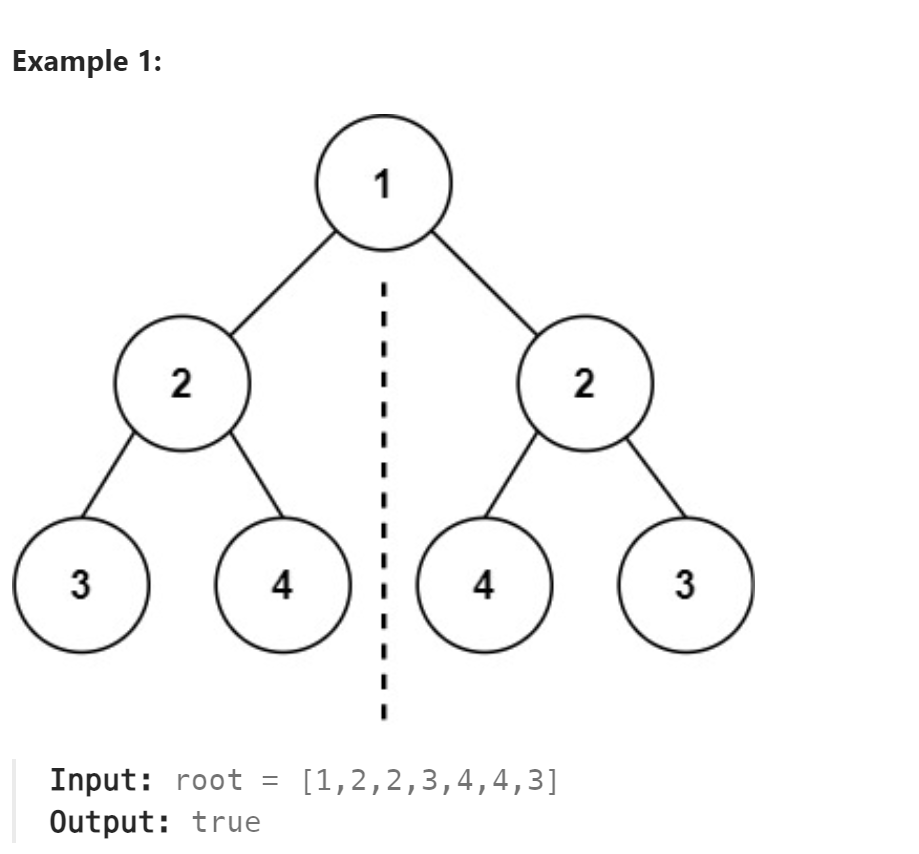

# 101. Symmetric Tree



## 难点

## C++
``` C++
bool compare(TreeNode *left,TreeNode *right)
{
    if (left==nullptr&&right!=nullptr) return false;
    else if (left!=nullptr&&right==nullptr) return false;
    else if (left==nullptr&&right==nullptr) return true;
    else if (left->val!=right->val) return false;

    return compare(left->right,right->left)&&compare(left->left,right->right);
}

bool isSymmetric(TreeNode* root) {
    if (root==nullptr) return true;
    return compare(root->left,root->right);
}
```

## Python
``` Python
def compare(self, left, right):
    if left and not right:
        return False
    elif not left and right:
        return False
    elif not left and not right:
        return True
    elif left.val != right.val:
        return False

    return self.compare(left.right, right.left) and self.compare(left.left, right.right)

def isSymmetric(self, root: Optional[TreeNode]) -> bool:
    if not root:
        return True
    return self.compare(root.left, root.right)
```