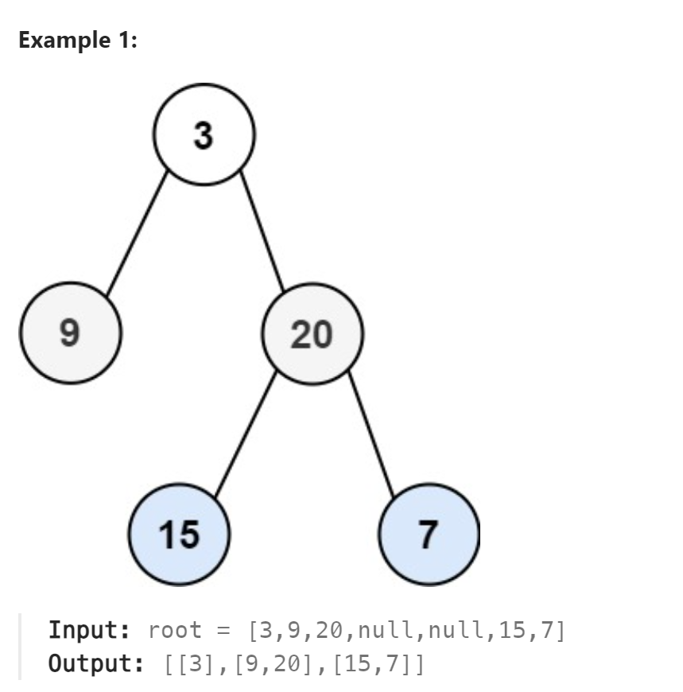

# 102. Binary Tree Level Order Traversal



## 难点
使用队列来模拟层序遍历

## C++
``` C++
vector<vector<int>> levelOrder(TreeNode* root) {
    vector<vector<int>> ans;
    if (root==nullptr) return ans;
    queue<TreeNode*> que;
    que.push(root);
    while (!que.empty())
    {
        vector<int> tmp;
        int size=que.size();
        for (int i=0;i<size;i++)
        {
            tmp.push_back(que.front()->val);
            if (que.front()->left) que.push(que.front()->left);
            if (que.front()->right) que.push(que.front()->right);
            que.pop();
        }
        ans.push_back(tmp);
    }
    return ans;
}
```

## Python
``` Python
def levelOrder(self, root: Optional[TreeNode]) -> List[List[int]]:
    ans=[]
    if not root:
        return ans
    que=deque([root])
    while que:
        size=len(que)
        tmp=[]
        for i in range(size):
            tmp.append(que[0].val)
            if que[0].left:
                que.append(que[0].left)
            if que[0].right:
                que.append(que[0].right)
            que.popleft()
        ans.append(tmp)
    return ans
```