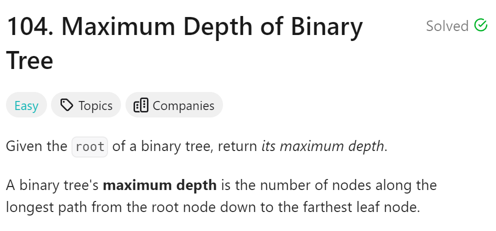
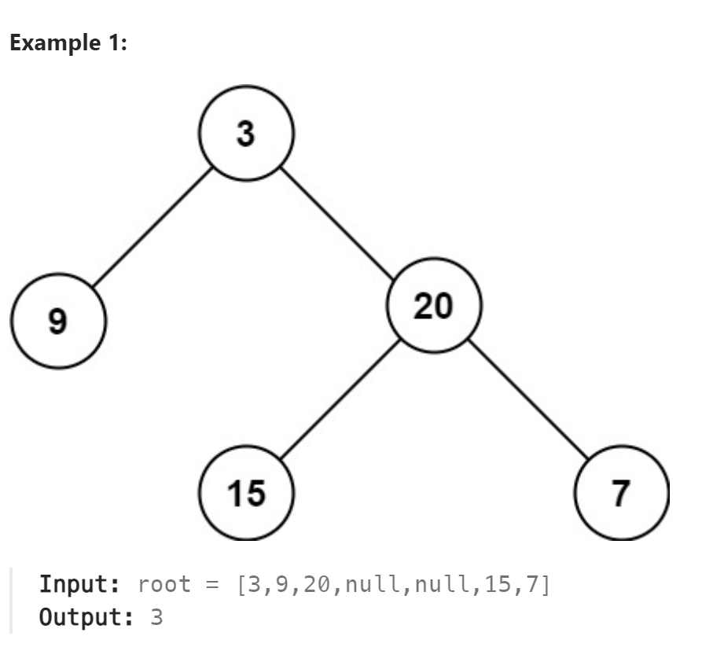

# 104. Maximum Depth of Binary Tree



## 难点

## C++
``` C++
int getDepth(TreeNode* cur)
{
    if (cur==nullptr) return 0;
    int leftcount=getDepth(cur->left);
    int rightcount=getDepth(cur->right);
    return 1+max(leftcount,rightcount);
}

int maxDepth(TreeNode* root) {
    return getDepth(root);
}
```

## Python
``` Python
def getDepth(self,cur):
    if not cur:
        return 0
    leftcount=self.getDepth(cur.left)
    rightcount=self.getDepth(cur.right)
    return 1+max(leftcount,rightcount)

def maxDepth(self, root: Optional[TreeNode]) -> int:
    return self.getDepth(root)
```