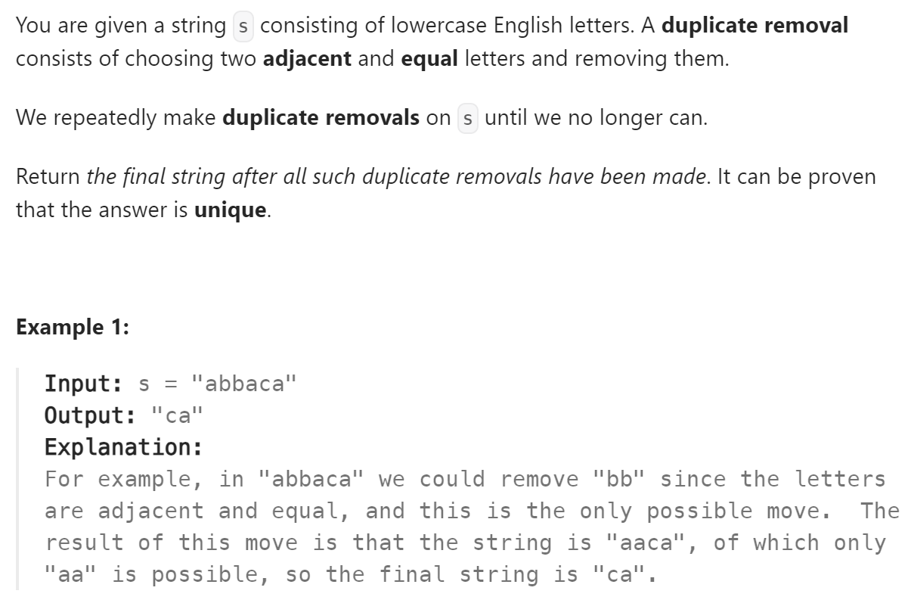

# 1047 Remove All Adjacent Duplicates In String


## 难点
stack的运用

## C++ 
``` C++
string removeDuplicates(string s) {
    stack<char> st;
    for (int i=0;i<s.size();i++)
    {
        if (st.empty() || s[i]!=st.top())
            st.push(s[i]);
        else
            st.pop();
    }
    string ans;
    while (!st.empty())
    {
        ans+=st.top();
        st.pop();
    }
    reverse(ans.begin(),ans.end());
    return ans;
}
```

## Python
``` Python
def removeDuplicates(self, s: str) -> str:
    stack=deque()
    for i in range(len(s)):
        if not stack or s[i]!=stack[-1]:
            stack.append(s[i])
        else:
            stack.pop()
    ans=""
    for ch in stack:
        ans+=ch
    return ans
```