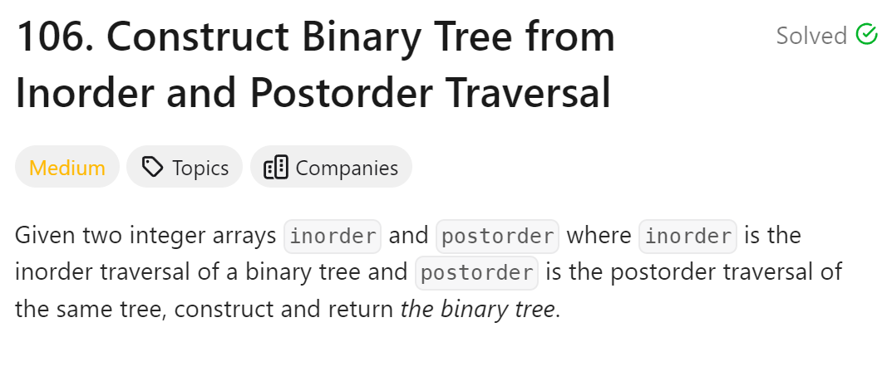
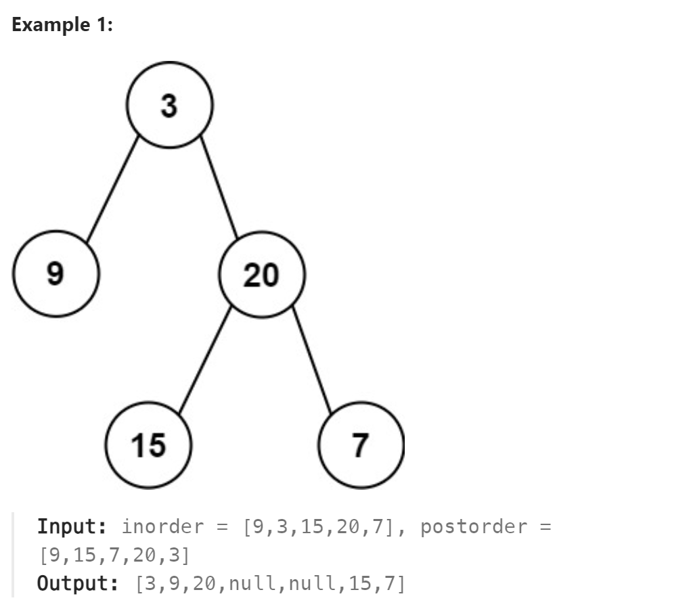

# 106. Construct Binary Tree from Inorder and Postorder Traversal



## 难点
在后续列表的最后一位确定根节点位置
用根节点分割中序列表，分成左右两个中序子树列表
用左右中序子树列表的size来分割后序子树列表
递归地求左右子树

## C++
``` C++
TreeNode* traversal(vector<int>& inorder,vector<int>& postorder)
{
    if (postorder.size()==0) return nullptr;
    int rootvalue=postorder[postorder.size()-1];
    TreeNode* root=new TreeNode(rootvalue);
    if (postorder.size()==1) return root;
    int index=0;
    for(;index<postorder.size();index++)
    {
        if (inorder[index]==rootvalue) break;
    }
    vector<int> leftinorder(inorder.begin(),inorder.begin()+index);
    vector<int> rightinorder(inorder.begin()+index+1,inorder.end());
    postorder.resize(postorder.size()-1);
    vector<int> leftpostorder(postorder.begin(),postorder.begin()+leftinorder.size());
    vector<int> rightpostorder(postorder.begin()+leftinorder.size(),postorder.end());
    root->left=traversal(leftinorder,leftpostorder);
    root->right=traversal(rightinorder,rightpostorder);
    return root;
}

TreeNode* buildTree(vector<int>& inorder, vector<int>& postorder) {
    if (inorder.size()==0||postorder.size()==0) return nullptr;
    return traversal(inorder,postorder);
}
```

## Python
``` Python
```