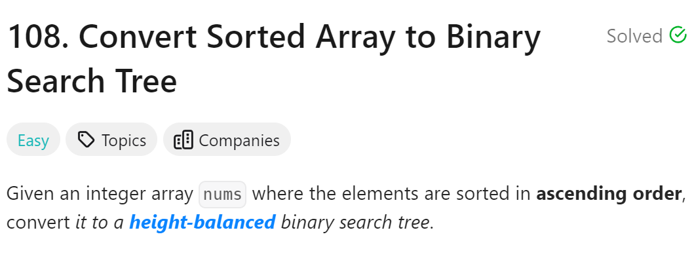

# 108. Convert Sorted Array to Binary Search Tree


## 难点
本题的做法就是找中间值，然后左右隔成子树。自然地会得到一个高度平衡的二叉搜索树

## C++
``` C++
class Solution {
public:
    TreeNode* traversal(vector<int>& nums,int left,int right)
    {
        if (left>=right) return nullptr;
        int tmp=(left+right)/2;
        TreeNode* cur=new TreeNode(nums[tmp]);
        cur->left=traversal(nums,left,tmp);
        cur->right=traversal(nums,tmp+1,right);
        return cur;
    }

    TreeNode* sortedArrayToBST(vector<int>& nums) {
        int left=0;
        int right=nums.size();
        TreeNode* root=traversal(nums,left,right);
        return root;
    }
};
```

## Python
``` Python
class Solution:
    def traversal(self,nums,left,right):
        if left>=right:
            return None
        mid=left+(right-left)//2
        cur=TreeNode(nums[mid])
        cur.left=self.traversal(nums,left,mid)
        cur.right=self.traversal(nums,mid+1,right)
        return cur

    def sortedArrayToBST(self, nums: List[int]) -> Optional[TreeNode]:
        right=len(nums)
        root=self.traversal(nums,0,right)
        return root
```