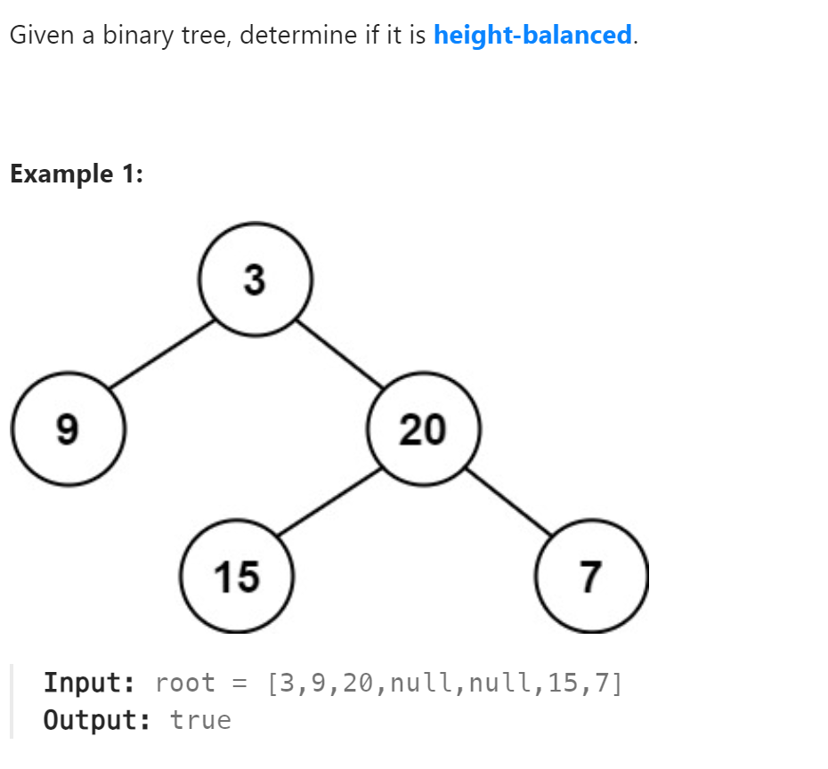

# 110. Balanced Binary Tree


## 难点
Height-balanced Tree指的是所有的结点左子树和右子树的高度差小于等于1。
求高度是自底向上，对每一个结点求出高度，并比较左右子树。
若已经发现违反条件，则直接取-1，跳过其它步骤。

## C++
``` C++
int getHeight(TreeNode* cur)
{
    if (cur==nullptr) return 0;
    int leftH=getHeight(cur->left);
    if (leftH==-1) return -1;
    int rightH=getHeight(cur->right);
    if (rightH==-1) return -1;
    if (abs(leftH-rightH)>1) return -1;
    else return 1+max(leftH,rightH);
}

bool isBalanced(TreeNode* root) {
    return getHeight(root)==-1?false:true;
}
```

## Python
``` Python
def getHeight(self,cur):
    if not cur:
        return 0
    leftH=self.getHeight(cur.left)
    if leftH==-1:
        return -1
    rightH=self.getHeight(cur.right)
    if rightH==-1:
        return -1
    if abs(leftH-rightH)>1:
        return -1
    else:
        return 1+max(leftH,rightH)

def isBalanced(self, root: Optional[TreeNode]) -> bool:
    if self.getHeight(root)==-1:
        return False
    else:
        return True
```