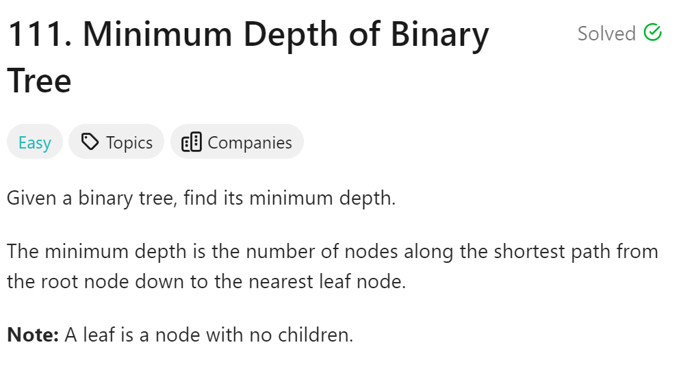
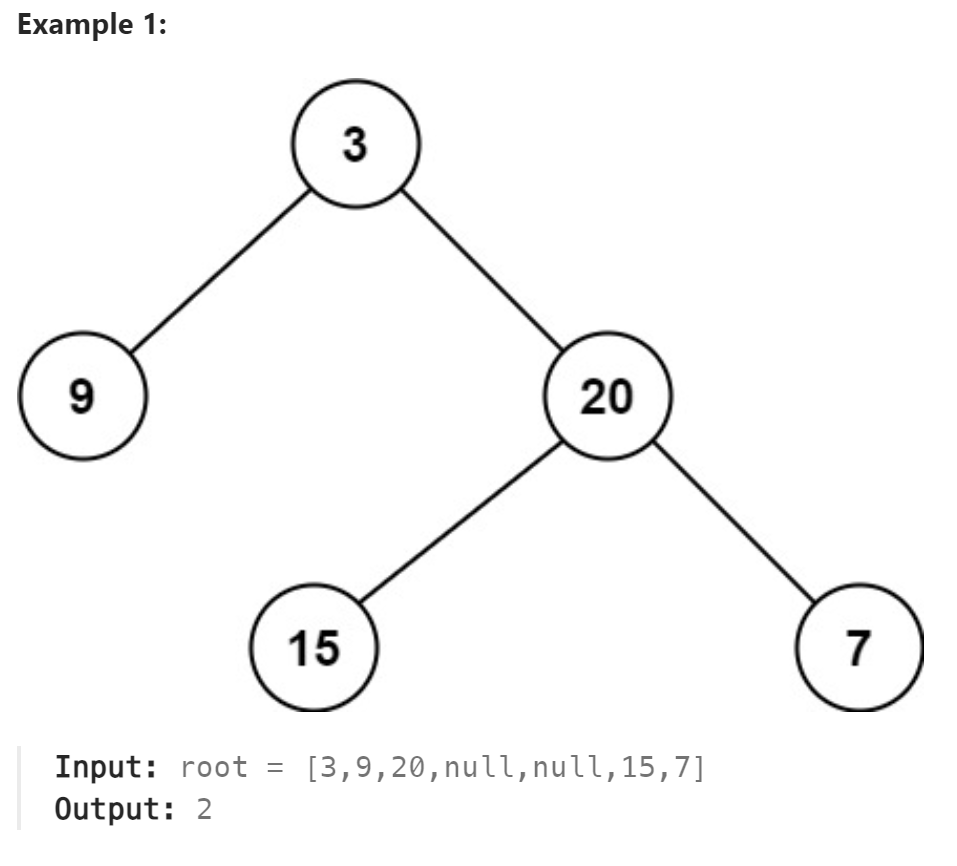

# 111 Minimum Depth of Binary Tree



## 难点
本题的难点在于求根到最近的叶子的距离，但是如果通过cur==nullptr很难判断是否是叶子结点，要对cur的左右节点都进行考虑

## C++
``` C++
int getDepth(TreeNode* cur)
{
    if (cur->left==nullptr&&cur->right==nullptr) return 1;
    int leftDepth=0,rightDepth=0;
    if (cur->left==nullptr) leftDepth=999999;
    else leftDepth=getDepth(cur->left);
    if (cur->right==nullptr) rightDepth=999999;
    else rightDepth=getDepth(cur->right);
    int depth=1+min(leftDepth,rightDepth);
    return depth;
}

int minDepth(TreeNode* root) {
    if (root==nullptr) return 0;
    return getDepth(root);
}
```

## Python
``` Python
def getDepth(self, cur):
    if not cur.left and not cur.right:
        return 1
    leftdepth=0
    rightdepth=0
    if cur.left:
        leftdepth=self.getDepth(cur.left)
    else:
        leftdepth=99999
    if cur.right:
        rightdepth=self.getDepth(cur.right)
    else:
        rightdepth=99999
    depth=1+min(leftdepth,rightdepth)
    return depth
    
def minDepth(self, root: Optional[TreeNode]) -> int:
    if not root:
        return 0
    return self.getDepth(root)
```