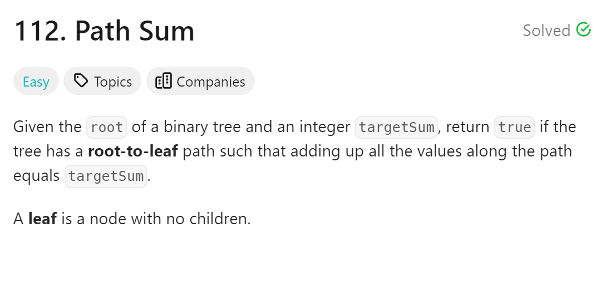
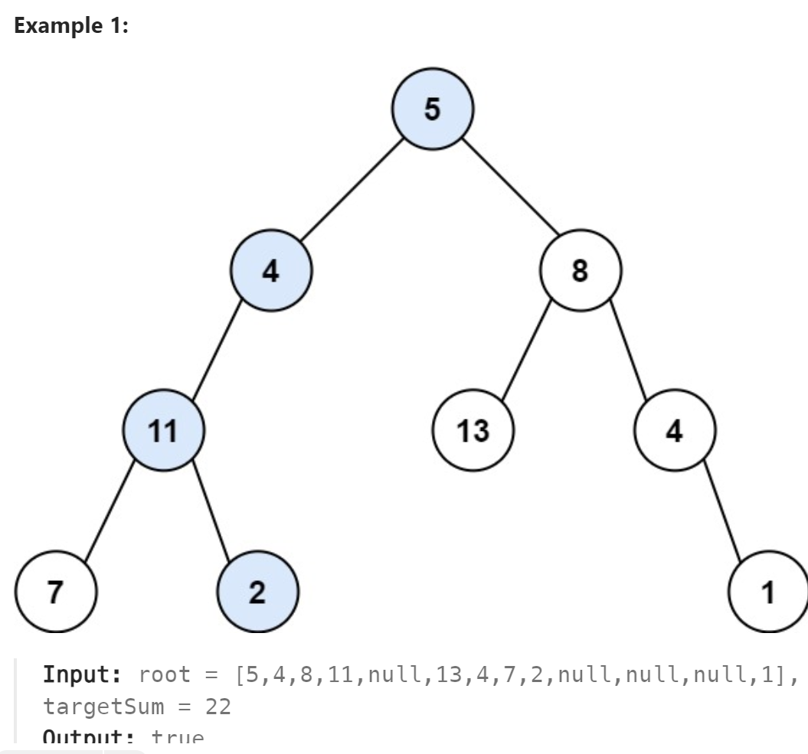

# 112. Path Sum



## 难点
本题难点在于要考虑到负数的情况，终止条件要想好

## C++
``` C++
bool traversal(TreeNode* cur, int targetSum, int& sum)
{
    sum+=cur->val;
    if (cur->left==nullptr&&cur->right==nullptr)
    {
        if (sum==targetSum)
        {
            sum-=cur->val;
            return true;
        }
        else
        {
            sum-=cur->val;
            return false;
        }
    }
    bool left=false, right=false;
    if (cur->left) left=traversal(cur->left,targetSum,sum);
    if (cur->right) right=traversal(cur->right,targetSum,sum);
    sum-=cur->val;
    return left||right;
}

bool hasPathSum(TreeNode* root, int targetSum) {
    if (root==nullptr) return false;
    int sum=0;
    return traversal(root,targetSum,sum);
}
```

## Python
``` Python
def traversal(self,cur,targetSum,sum):
    sum+=cur.val
    if not cur.left and not cur.right:
        if sum==targetSum:
            sum-=cur.val
            return True
        else:
            sum-=cur.val
            return False
    if cur.left:
        if self.traversal(cur.left,targetSum,sum):
            sum-=cur.val
            return True
    if cur.right:
        if self.traversal(cur.right,targetSum,sum):
            sum-=cur.val
            return True
    sum-=cur.val
    return False

def hasPathSum(self, root: Optional[TreeNode], targetSum: int) -> bool:
    if not root:
        return False
    sum=0
    return self.traversal(root,targetSum,sum)
```