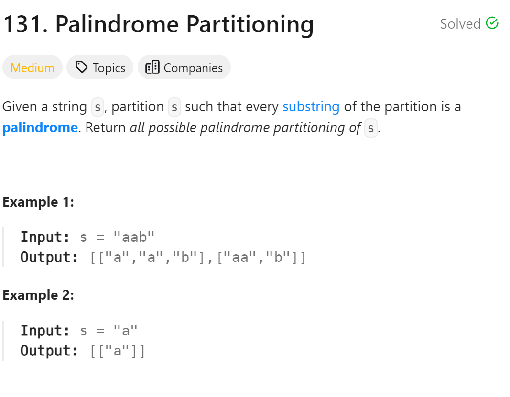

# 131. Palindrome Partitioning


## 难点
本题的难点在于如何去切割一个字符串，其实是模拟切割线，在找到一条线后找下一条切割线是用回溯算法。

## C++
``` C++
class Solution {
public:
    vector<vector<string>> ans;
    vector<string> path;
    void backtracking(string s, int startIndex)
    {
        if (startIndex>=s.size())
        {
            ans.push_back(path);
            return;
        }
        for (int i=startIndex;i<s.size();i++)
        {
            if (isPalindrome(s,startIndex,i))
            {
                string str=s.substr(startIndex,i-startIndex+1);
                path.push_back(str);
            }
            else
                continue;
            backtracking(s,i+1);
            path.pop_back();
        }
    }

    bool isPalindrome(string s, int startIndex,int endIndex)
    {
        for (int i=startIndex,j=endIndex;i<j;i++,j--)
        {
            if (s[i]!=s[j])
                return false;
        }
        return true;
    }

    vector<vector<string>> partition(string s) {
        backtracking(s,0);
        return ans;
    }
};
```

## Python
``` Python
class Solution:
    def backtracking(self,s,startIndex,ans,path):
        if startIndex>=len(s):
            ans.append(path[:])
            return
        for i in range(startIndex,len(s)):
            if self.ispalindrome(s,startIndex,i):
                path.append(s[startIndex:i+1])
            else:
                continue
            self.backtracking(s,i+1,ans,path)
            path.pop()
    
    def ispalindrome(self,s,start,end):
        i=start
        j=end
        while i<j:
            if s[i]!=s[j]:
                return False
            i+=1
            j-=1
        return True

    def partition(self, s: str) -> List[List[str]]:
        ans=[]
        path=[]
        self.backtracking(s,0,ans,path)
        return ans
```