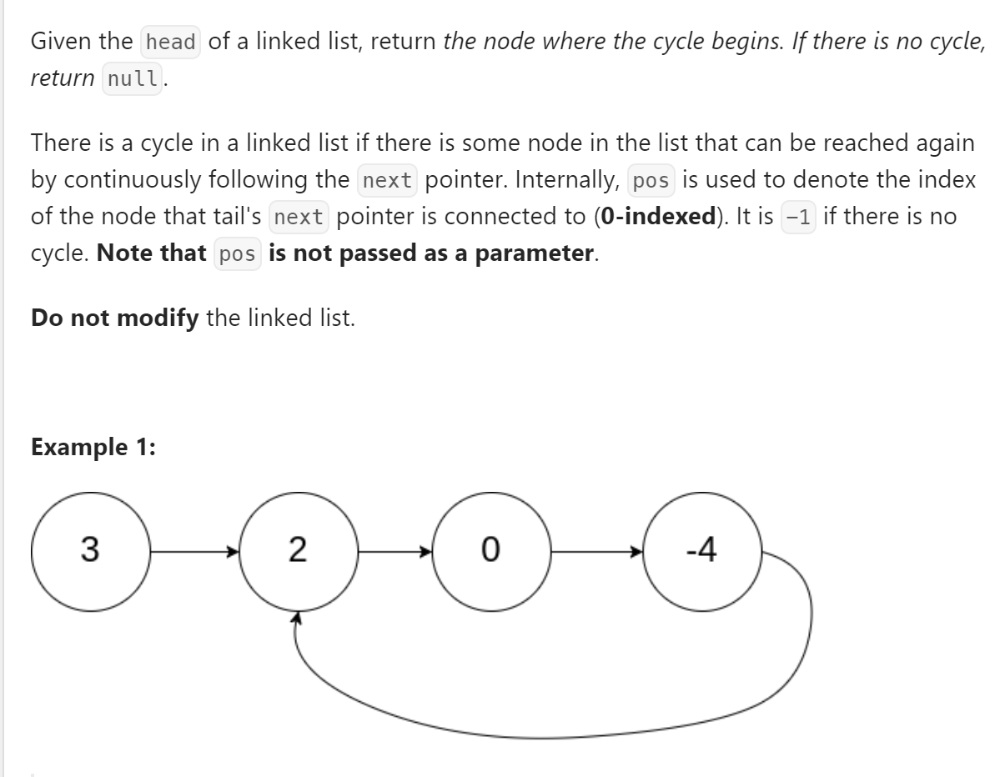
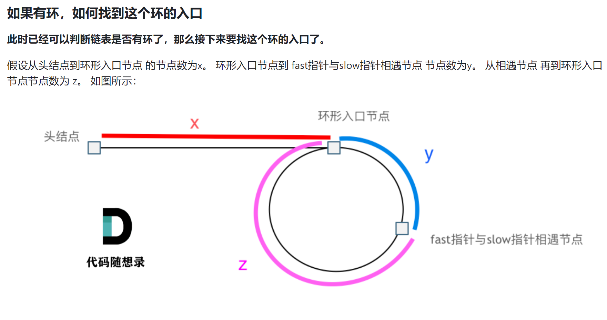

# 142. Linked List Cycle II


## 难点
本题的难点有两点，第一点在于判断链表是否是循环链表，第二点在于如何找到循环链表的起始点。
为了解决第一点，我采用了快慢双指针的方式，快指针一次走两步，慢指针一次走一步。这样如果链表循环，则两个指针必能在环内相遇。
为了解决第二点需要计算指针行走的路程

那么相遇时： slow指针走过的节点数为: x + y， fast指针走过的节点数： x + y + n (y + z)，n为fast指针在环内走了n圈才遇到slow指针， （y+z）为 一圈内节点的个数A。
因为fast指针是一步走两个节点，slow指针一步走一个节点， 所以 fast指针走过的节点数 = slow指针走过的节点数 * 2：
(x + y) * 2 = x + y + n (y + z)
两边消掉一个（x+y）: x + y  = n (y + z) 
因为要找环形的入口，那么要求的是x，因为x表示 头结点到 环形入口节点的的距离。
所以要求x ，将x单独放在左面：x = n (y + z) - y ,
再从n(y+z)中提出一个 （y+z）来，整理公式之后为如下公式：x = (n - 1) (y + z) + z   注意这里n一定是大于等于1的，因为 fast指针至少要多走一圈才能相遇slow指针。
这个公式说明什么呢？
先拿n为1的情况来举例，意味着fast指针在环形里转了一圈之后，就遇到了 slow指针了。
当 n为1的时候，公式就化解为 x = z，
这就意味着，从头结点出发一个指针，从相遇节点 也出发一个指针，这两个指针每次只走一个节点， 那么当这两个指针相遇的时候就是 环形入口的节点。
也就是在相遇节点处，定义一个指针index1，在头结点处定一个指针index2。
让index1和index2同时移动，每次移动一个节点， 那么他们相遇的地方就是 环形入口的节点。

## C++
``` C++
ListNode *detectCycle(ListNode *head) {
    if (head==nullptr||head->next==nullptr) return NULL;
    ListNode *slow=head, *fast=head;
    while(fast!=nullptr||fast->next!=nullptr)
    {
        slow=slow->next;
        fast=fast->next->next;
        if (fast==nullptr||fast->next==nullptr)
            return NULL;
        if (slow==fast)
            break;
    }
    ListNode *secondRound=head;
    while(secondRound!=slow)
    {
        slow=slow->next;
        secondRound=secondRound->next;
    }
    return slow;
}
```

## Python
``` Python
def detectCycle(self, head: Optional[ListNode]) -> Optional[ListNode]:
    if head==None or head.next==None:
        return None
    slow=head
    fast=head
    while fast!=None or fast.next!=None:
        slow=slow.next
        fast=fast.next.next
        if slow==fast:
            break
        if fast==None or fast.next==None:
            return None
    sec_round=head
    while slow!=sec_round:
        slow=slow.next
        sec_round=sec_round.next
    return slow
```