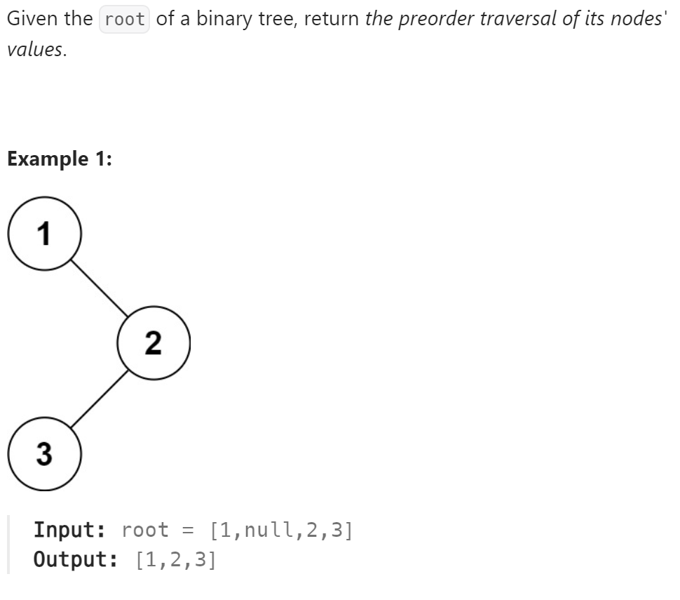

# 144 Binary Tree Preorder Traversal


## 难点
前序遍历是根左右

## C++
``` C++
void traversal(TreeNode* cur, vector<int>& ans)
{
    if (cur==nullptr)
        return;
    ans.push_back(cur->val);
    traversal(cur->left,ans);
    traversal(cur->right,ans);
}

vector<int> preorderTraversal(TreeNode* root) {
    vector<int> ans;
    traversal(root,ans);
    return ans;
}
```

## Python
``` Python
class Solution:
    def traversal(self, cur, ans):
        if not cur:
            return
        ans.append(cur.val)
        self.traversal(cur.left,ans)
        self.traversal(cur.right,ans)

    def preorderTraversal(self, root: Optional[TreeNode]) -> List[int]:
        ans=[]
        self.traversal(root,ans)
        return ans
```