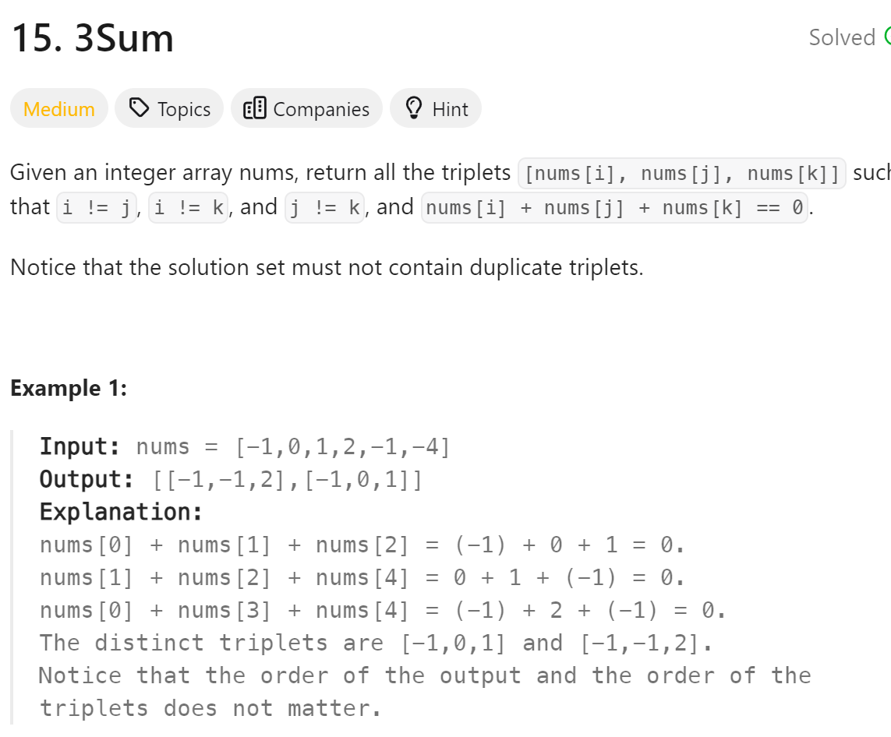

# 15 3Sum


## 难点
哈希法就是确定最小值a，不断增大最大值b，若c存在则必定在ab之间。
1，a去重
aaxb，从第一个a开始的组合有aab，axb，从第二个a有axb，重复
2，b去重
axbbb，第一个b结尾有axb，第二个有axb，abb，第三个axb，abb。从第三个开始重复。
3，set定义在for里面
确定了a，b。c只能从ab之间取。set里只能有ab之间的数。每次更换a，set都是从零开始。定义在外面，可能会取到先前记录的数，导致最小最大值不为ab，重复。定义在外面可以在for最后清空，性能稍好。

## C++
``` C++
vector<vector<int>> threeSum(vector<int>& nums) {
    vector<vector<int>> ans;
    sort(nums.begin(),nums.end());
    for (int i=0;i<nums.size();i++)
    {
        if (nums[i]>0) break;
        if (i>0&&nums[i]==nums[i-1]) continue;
        unordered_set<int> set;
        for (int j=i+1;j<nums.size();j++)
        {
            if (j>i+2&&nums[j]==nums[j-1]&&nums[j]==nums[j-2])
                continue;
            int c=0-nums[i]-nums[j];
            if (set.find(c)!=set.end())
            {
                ans.push_back({nums[i],nums[j],c});
                set.erase(c);
            }
            else
                set.insert(nums[j]);
        }
    }
    return ans;
}
```

## Python
``` Python
def threeSum(self, nums: List[int]) -> List[List[int]]:
    ans=[]
    nums.sort()
    for i in range(len(nums)):
        if nums[i]>0:
            break
        if i>0 and nums[i]==nums[i-1]:
            continue
        tmp_set=set()
        for j in range(i+1,len(nums)):
            if j>i+2 and nums[j]==nums[j-1]==nums[j-2]:
                continue
            c=0-nums[i]-nums[j]
            if c in tmp_set:
                ans.append([nums[i],nums[j],c])
                tmp_set.remove(c)
            else:
                tmp_set.add(nums[j])
    return ans
```