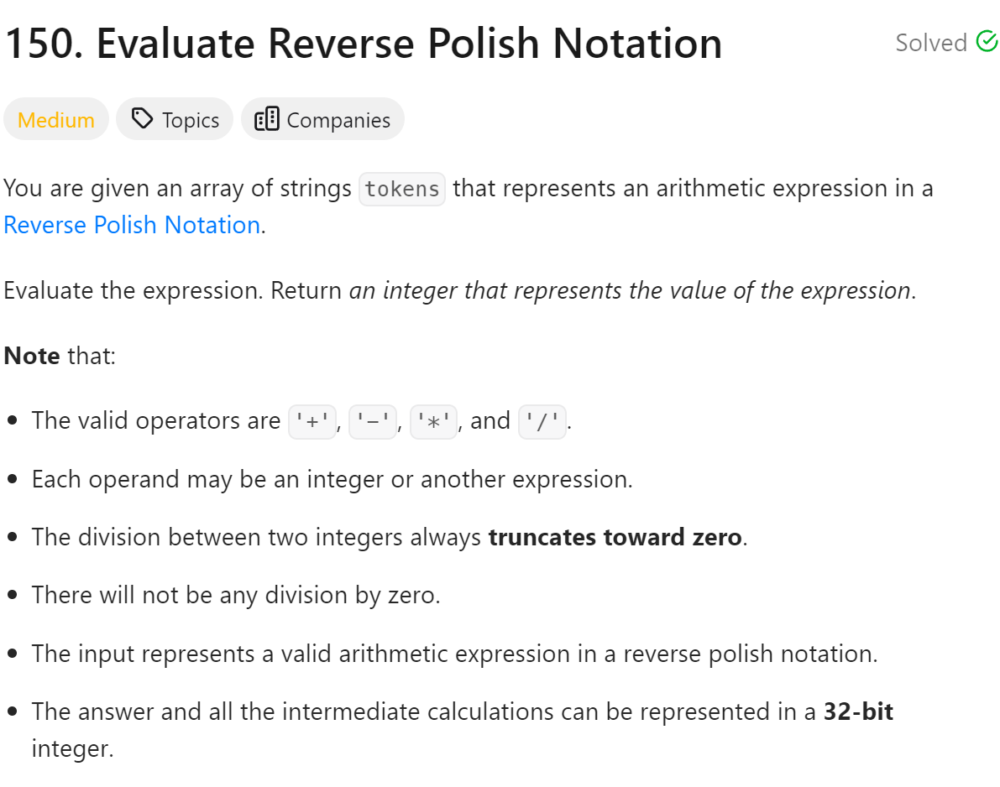
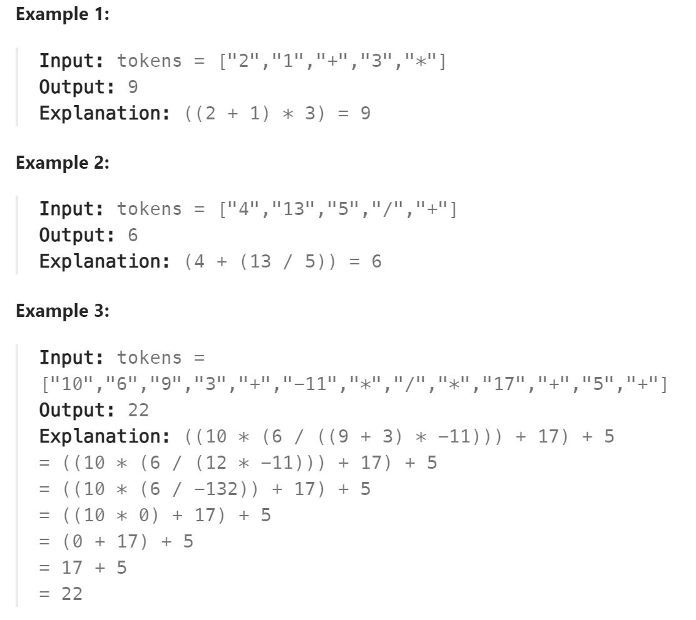

# 150 Evaluate Reverse Polish Notation



## 难点
python在取整的时候要注意负数的情况，可能会和预想的结果不符，考虑使用int(tmp1/tmp2)

## C++
``` C++
int evalRPN(vector<string>& tokens) {
    stack<long long> st;
    for (int i=0;i<tokens.size();i++)
    {
        if (tokens[i]!="+"&&tokens[i]!="-"&&tokens[i]!="*"&&tokens[i]!="/")
            st.push(stoll(tokens[i]));
        else
        {
            long long tmp1=st.top();
            st.pop();
            long long tmp2=st.top();
            st.pop();
            if (tokens[i]=="+") st.push(tmp1+tmp2);
            else if (tokens[i]=="-") st.push(tmp2-tmp1);
            else if (tokens[i]=="*") st.push(tmp1*tmp2);
            else if (tokens[i]=="/") st.push(tmp2/tmp1);
        }
    }
    return st.top();
}
```

## Python
``` Python
def evalRPN(self, tokens: List[str]) -> int:
    stack=deque()
    for i in range(len(tokens)):
        if tokens[i]!="+" and tokens[i]!="-" and tokens[i]!="*" and tokens[i]!="/":
            stack.append(int(tokens[i]))
        else:
            tmp1=stack.pop()
            tmp2=stack.pop()
            if tokens[i]=="+":
                stack.append(tmp2+tmp1)
            if tokens[i]=="-":
                stack.append(tmp2-tmp1)
            if tokens[i]=="*":
                stack.append(tmp2*tmp1)
            if tokens[i]=="/":
                stack.append(int(tmp2/tmp1))
    return stack[0]
```