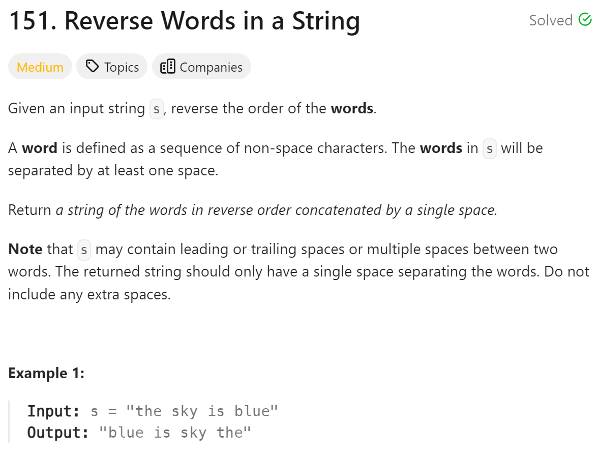

# 151 Reverse Words in a String


## 难点
本题用split做会非常容易，但是失去意义。
本题思路是先移除多余空格，然后对整体字符串翻转，再通过空格识别出单词，对每个单词在进行单一翻转，就可得出解。
用双指针的方式来移除多余空格，达到O(n)时间复杂度。注意不要用erase，因为erase本身的时间复杂度就是O(N)，再加上一个for循环就是O(n^2)了。

## C++
``` C++
void removeExtraSpace(string &s)
{
    int slow=0;
    for (int i=0;i<s.size();i++)
    {
        if (s[i]!=' ')
        {
            if (slow!=0) s[slow++]=' ';
            while(i<s.size()&&s[i]!=' ')
                s[slow++]=s[i++];
        }
    }
    s.resize(slow);
}


void reversestr(string &s, int start, int end)
{
    for (int i=start,j=end;i<j;i++,j--)
        swap(s[i],s[j]);
}

string reverseWords(string s) {
    removeExtraSpace(s);
    reversestr(s,0,s.size()-1);
    int start=0;
    for (int i=0;i<=s.size();i++)
    {
        if (i==s.size()||s[i]==' ')
        {
            reversestr(s,start, i-1);
            start=i+1;
        }
    }
    return s;
}
```