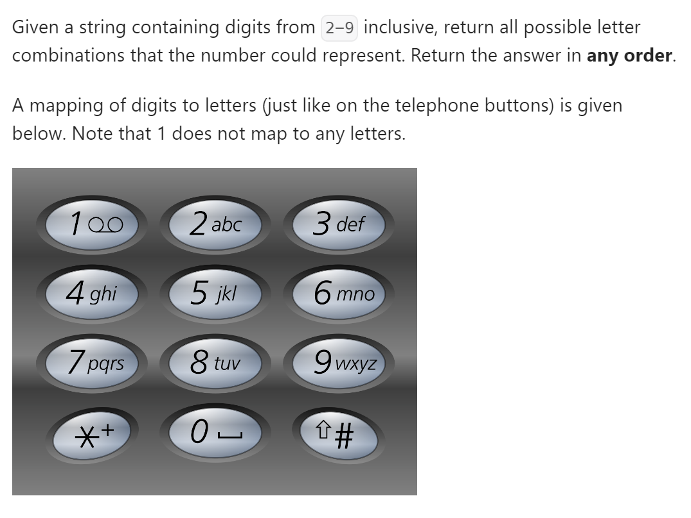
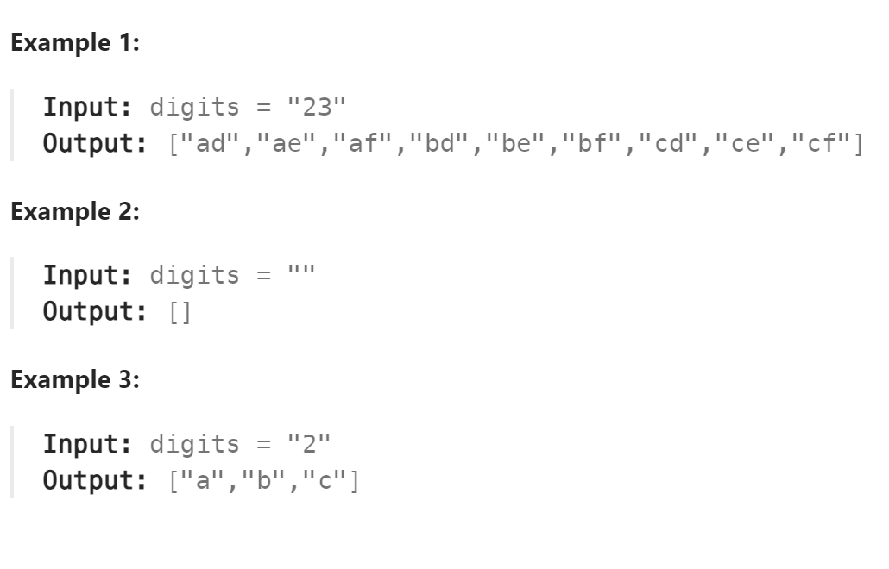

# 17. Letter Combinations of a Phone Number



## 难点

## C++
``` C++
class Solution {
private:
    const string letterMap[10] = {
        "", // 0
        "", // 1
        "abc", // 2
        "def", // 3
        "ghi", // 4
        "jkl", // 5
        "mno", // 6
        "pqrs", // 7
        "tuv", // 8
        "wxyz", // 9
    };

public:
    vector<string> ans;
    string s;
    void backtracking(string digits)
    {
        if (s.size()==digits.size())
        {
            ans.push_back(s);
            return;
        }
        int index=digits[s.size()]-'0';
        for (int i=0;i<letterMap[index].size();i++)
        {
            s.push_back(letterMap[index][i]);
            backtracking(digits);
            s.pop_back();
        }
    }

    vector<string> letterCombinations(string digits) {
        if (digits.size()==0) return ans;
        backtracking(digits);
        return ans;
    }
};
```

## Python
``` Python
class Solution:
    def __init__(self):
        self.letterMap = [
            "",     # 0
            "",     # 1
            "abc",  # 2
            "def",  # 3
            "ghi",  # 4
            "jkl",  # 5
            "mno",  # 6
            "pqrs", # 7
            "tuv",  # 8
            "wxyz"  # 9
        ]
        self.ans = []
        self.s = ""

    def backtracking(self,digits):
        if len(self.s)==len(digits):
            self.ans.append(self.s)
            return
        index=int(digits[len(self.s)])
        for i in range(len(self.letterMap[index])):
            self.s+=self.letterMap[index][i]
            self.backtracking(digits)
            self.s=self.s[:-1]

    def letterCombinations(self, digits: str) -> List[str]:
        if len(digits)==0:
            return self.ans
        self.backtracking(digits)
        return self.ans
```