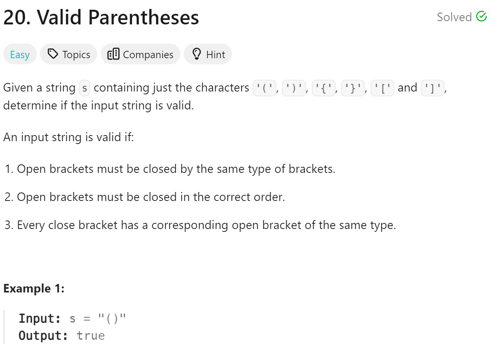

# 20 Valid Parentheses


## 难点

## C++
``` C++
bool isValid(string s) {
    stack<char> st;
    for (char ch:s)
    {
        if (ch=='(') st.push(')');
        else if (ch=='[') st.push(']');
        else if (ch=='{') st.push('}');
        else if (st.empty()||st.top()!=ch) return false;
        else st.pop();
    }
    return st.empty();
}
```

## Python
``` Python
def isValid(self, s: str) -> bool:
    stack=[]
    for ch in s:
        if ch=='(':
            stack.append(')')
        elif ch=='[':
            stack.append(']')
        elif ch=='{':
            stack.append('}')
        elif not stack or stack[-1]!=ch:
            return False
        else:
            stack.pop()
    return not stack
```