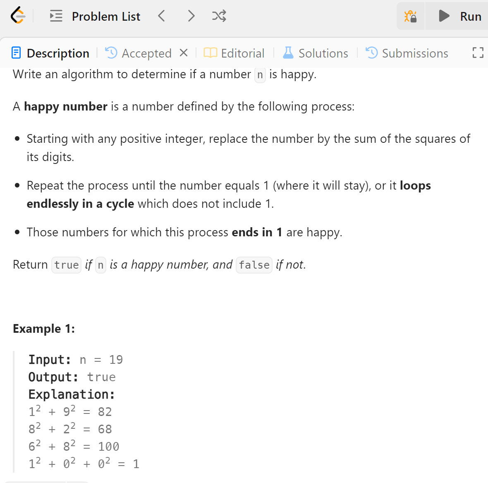

# 202 Happy Number


## 难点
注意python中/和//的区别，防止陷入无限循环

## C++
``` C++
bool isHappy(int n) {
    unordered_set<int> sums;
    int sum=n;
    while(sum!=1)
    {
        int tmp=0;
        while(sum!=0)
        {
            tmp+=(sum%10)*(sum%10);
            sum/=10;
        }
        sum=tmp;
        if (sums.count(sum))
            return false;
        else
            sums.insert(sum);
    }
    return true;
}
```

#Python
``` Python
def isHappy(self, n: int) -> bool:
    sums=set()
    sum=n
    while sum!=1:
        tmp=0
        while sum!=0:
            tmp+=(sum%10)**2
            sum//=10
        sum=tmp
        if sum in sums:
            return False
        else:
            sums.add(sum)
    return True
```