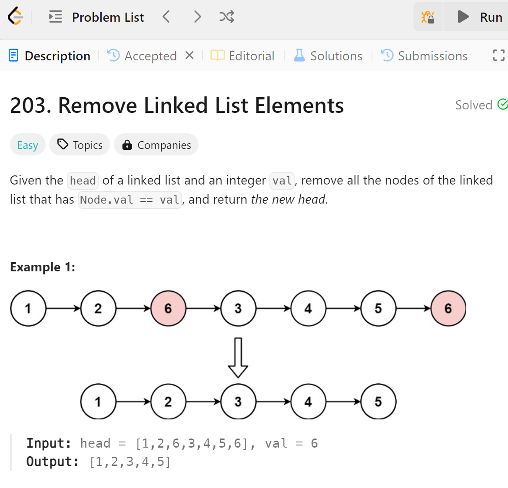

# 203 Remove Linked List Elements


## 列表定义
``` python
Definition for singly-linked list.
class ListNode:
   def __init__(self, val=0, next=None):
      self.val = val
      self.next = next
```

## 难点
本题难点在于列表节点的初始化
在C++中，使用new关键词来新定义一个节点，
在Python中，可以直接使用class name来申明一个新的节点

## C++
``` C++
ListNode* removeElements(ListNode* head, int val) {
    if(head==nullptr) return head;
    ListNode* Fhead= new ListNode(NULL, head);
    ListNode* pre, *cur;
    pre=Fhead;
    cur=head;
    while(cur!=nullptr)
    {
        cout << cur->val;
        if (cur->val==val)
        {
            pre->next=cur->next;
            delete cur;
            cur=pre->next;
        }
        else{
            pre=cur;
            cur=cur->next;
        }
    }
    return Fhead->next;
}
```

## Python
``` Python
def removeElements(self, head: Optional[ListNode], val: int) -> Optional[ListNode]:
    dummy_head=ListNode(-1)
    dummy_head.next=head
    pre=dummy_head
    cur=head
    while cur!=None:
        if cur.val==val:
            pre.next=cur.next
            del cur
            cur=pre.next
        else:
            pre=cur
            cur=cur.next
    return dummy_head.next
```