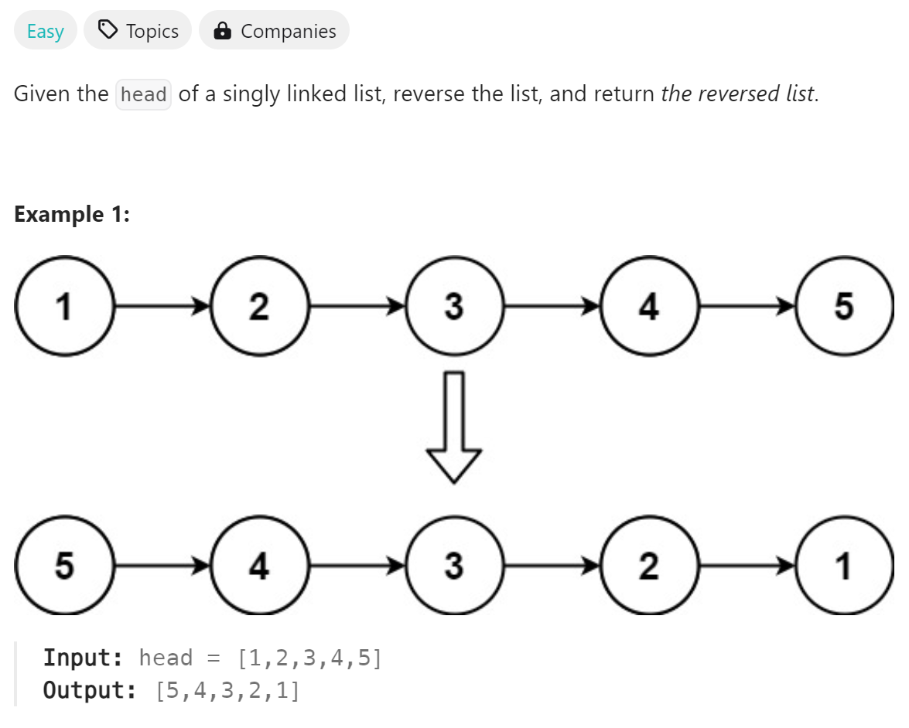

# 206 Reverse Linked List


## 难点
没有难点

## C++
``` C++
/**
 * Definition for singly-linked list.
 * struct ListNode {
 *     int val;
 *     ListNode *next;
 *     ListNode() : val(0), next(nullptr) {}
 *     ListNode(int x) : val(x), next(nullptr) {}
 *     ListNode(int x, ListNode *next) : val(x), next(next) {}
 * };
 */
class Solution {
public:
    ListNode* reverseList(ListNode* head) {
        if (head==nullptr||head->next==nullptr)
            return head;
        ListNode *pre=nullptr;
        ListNode *cur=head;
        while(cur!=nullptr)
        {
            ListNode *nextnode=cur->next;
            cur->next=pre;
            pre=cur;
            cur=nextnode;
        }
        return pre;
    }
};
```

## Python
``` Python
# Definition for singly-linked list.
# class ListNode:
#     def __init__(self, val=0, next=None):
#         self.val = val
#         self.next = next
class Solution:
    def reverseList(self, head: Optional[ListNode]) -> Optional[ListNode]:
        if head==None or head.next==None:
            return head
        pre=None
        cur=head
        while cur!=None:
            nextnode=cur.next
            cur.next=pre
            pre=cur
            cur=nextnode
        return pre
```