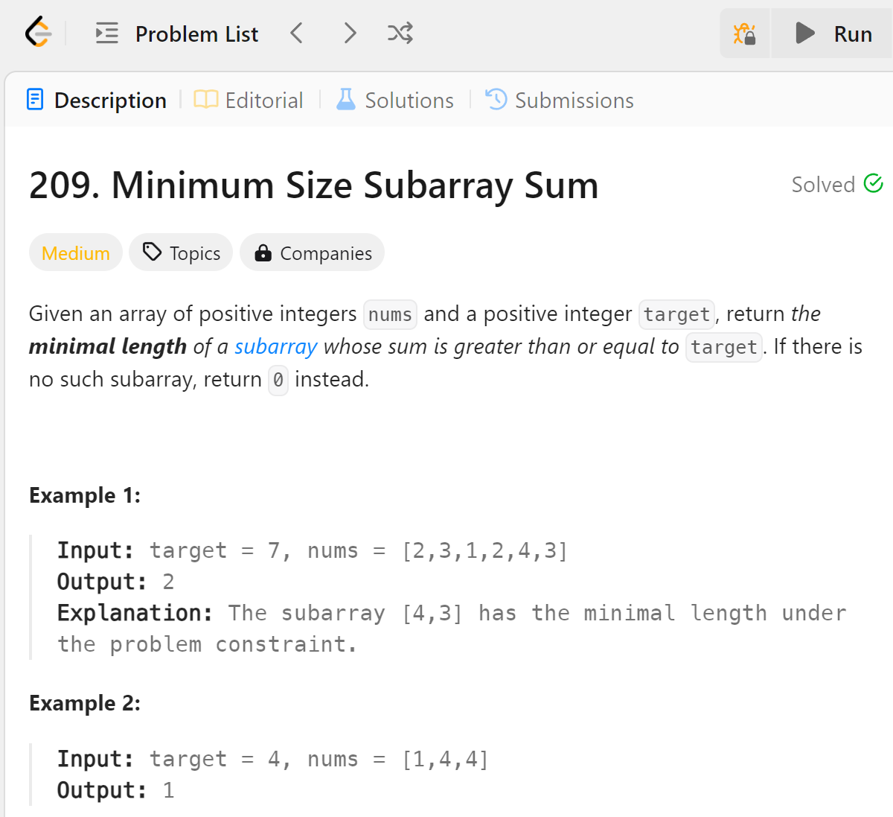

# 209 Minimum Size Subarray Sum


## 难点
本题使用的方法是双指针法，难点在于左边指针不是一次减少一个，是要把所有能够减掉的都减掉，所以要用while循环。min_size是数列元素数加一是为了防止出现结果是整个数列，导致无法判断的情况

## C++
``` C++
int minSubArrayLen(int target, vector<int>& nums) {
    int left=0, right=0;
    int sum=0,num=0,min_size=nums.size()+1;
    for (int i=0;i<nums.size();i++)
    {
        if (sum==target) min_size=min(min_size,num);
        sum+=nums[right];
        right++;
        num++;
        while (sum-nums[left]>=target)
        {
            sum-=nums[left];
            left++;
            num--;
        } 
        if (sum>=target) min_size=min(min_size,num);
    }
    return min_size==nums.size()+1 ? 0 : min_size;
}
```

## Python
``` python
def minSubArrayLen(self, target: int, nums: List[int]) -> int:
    left=0
    right=0
    sum=0
    num=0
    min_size=float('inf')
    while right<len(nums):
        sum+=nums[right]
        right+=1
        num+=1
        while sum-nums[left]>=target:
            sum-=nums[left]
            left+=1
            num-=1
        if sum>=target:
            min_size=min(min_size,num)
    return 0 if min_size==float('inf') else min_size
```