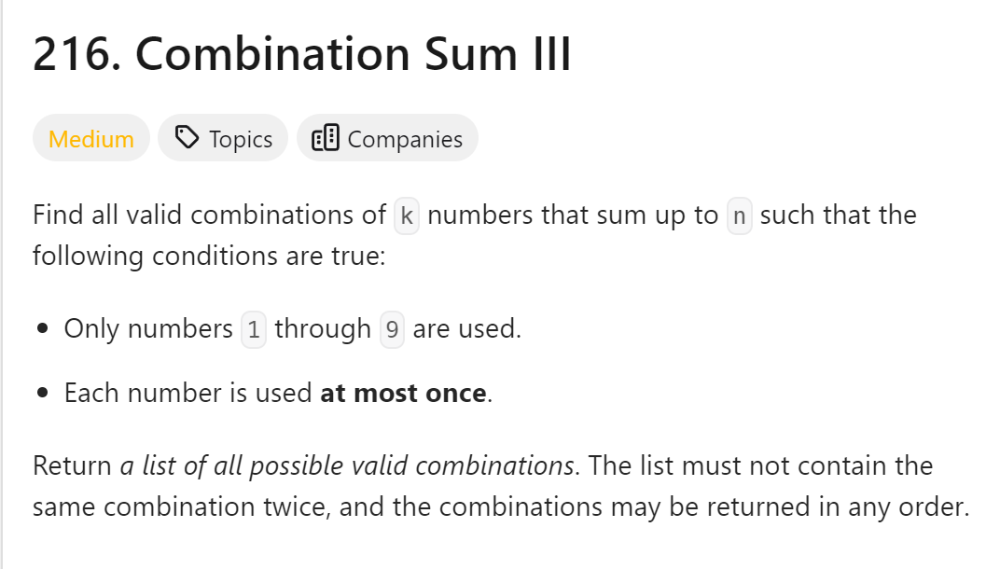
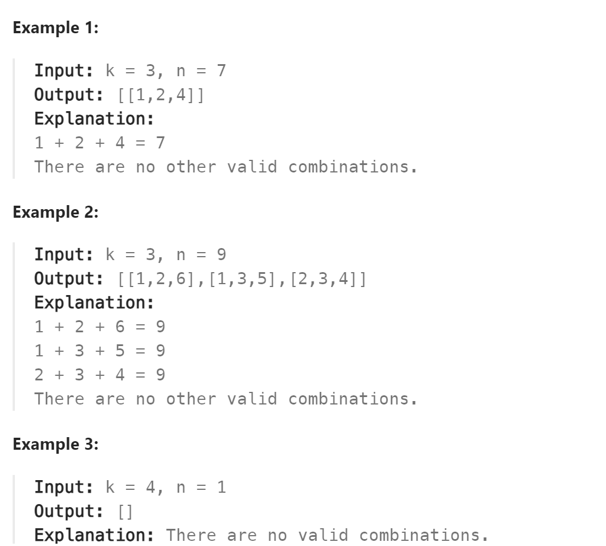

# 216. Combination Sum III



## 难点

## C++
``` C++
class Solution {
public:
    vector<vector<int>> ans;
    vector<int> path;
    void backtracking(int k,int n,int sum,int startIndex)
    {
        if (sum>n) return;
        if (path.size()==k)
        {
            if (sum==n)
                ans.push_back(path);
            return;
        }
        for (int i=startIndex;i<=9-(k-path.size())+1;i++)
        {
            path.push_back(i);
            sum+=i;
            backtracking(k,n,sum,i+1);
            path.pop_back();
            sum-=i;
        }
    }

    vector<vector<int>> combinationSum3(int k, int n) {
        backtracking(k,n,0,1);
        return ans;
    }
};
```

