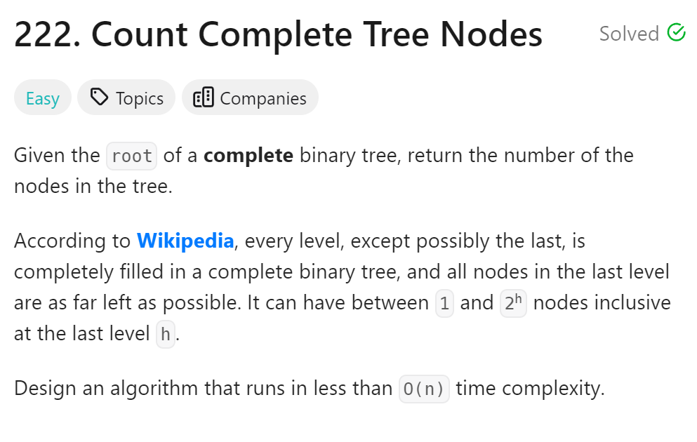
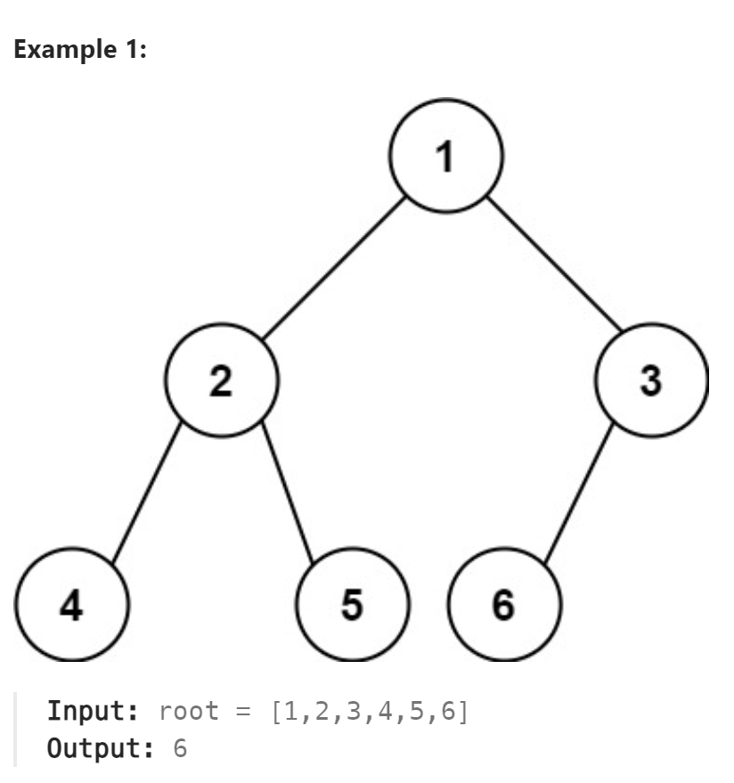

# 222. Count Complete Tree Nodes



## 难点
本题可以用遍历二叉树的方法去做，但是时间复杂度不是最优
最优的方法把完全二叉树分解成一个一个小的满二叉树，通过公式N=2^h-1计算满二叉树的节点总数。
判断满二叉树的方法是最左叶节点的深度等于最右叶结点的深度。

## C++
``` C++
int countNodes(TreeNode* root) {
    if (root==nullptr) return 0;
    TreeNode* left=root,*right=root;
    int leftCount=0,rightCount=0;
    while(left)
    {
        left=left->left;
        leftCount++;
    }
    while(right)
    {
        right=right->right;
        rightCount++;
    }
    if (leftCount==rightCount)
    {
        int ans=(1<<leftCount)-1;
        return ans;
    }
    return countNodes(root->left)+countNodes(root->right)+1;
}
```

## Python
``` Python
def countNodes(self, root: Optional[TreeNode]) -> int:
    if not root:
        return 0
    left=root
    right=root
    leftCount=0
    rightCount=0
    while left:
        left=left.left
        leftCount+=1
    while right:
        right=right.right
        rightCount+=1
    if leftCount==rightCount:
        return (1<<leftCount)-1
    return self.countNodes(root.left)+self.countNodes(root.right)+1
```