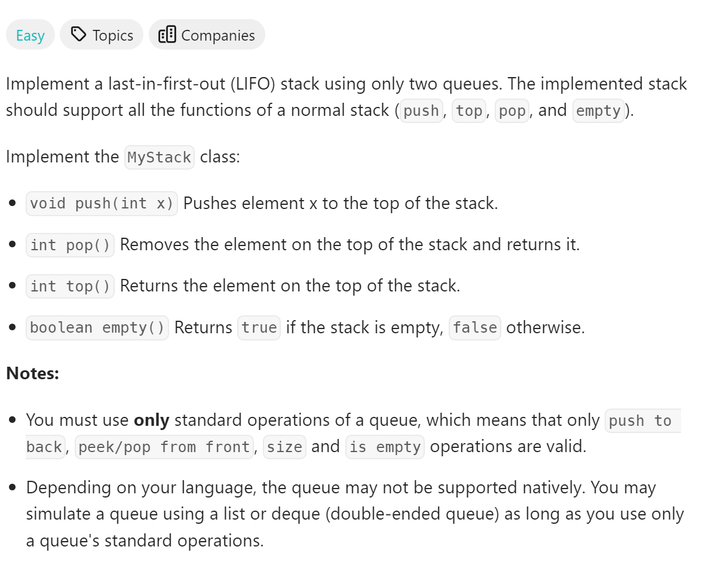

# 225. Implement Stack using Queues


## 难点
用一个queue就可以做
Python使用deque来实现更快地两端操作的队列

## C++
``` C++
class MyStack {
public:
    queue<int> q;
    MyStack() {
        
    }
    
    void push(int x) {
        q.push(x);
    }
    
    int pop() {
        int sizeq=q.size();
        sizeq--;
        while(sizeq--)
        {
            q.push(q.front());
            q.pop();
        }
        int ans=q.front();
        q.pop();
        return ans;
    }
    
    int top() {
        int tmp=this->pop();
        q.push(tmp);
        return tmp;
    }
    
    bool empty() {
        return q.empty();
    }
};

/**
 * Your MyStack object will be instantiated and called as such:
 * MyStack* obj = new MyStack();
 * obj->push(x);
 * int param_2 = obj->pop();
 * int param_3 = obj->top();
 * bool param_4 = obj->empty();
 */
```

## Python
``` Python
class MyStack:

    def __init__(self):
        self.q=deque()

    def push(self, x: int) -> None:
        self.q.append(x)

    def pop(self) -> int:
        for i in range(len(self.q)-1):
            self.q.append(self.q.popleft())
        return self.q.popleft()

    def top(self) -> int:
        tmp=self.pop()
        self.q.append(tmp)
        return tmp

    def empty(self) -> bool:
        return not self.q


# Your MyStack object will be instantiated and called as such:
# obj = MyStack()
# obj.push(x)
# param_2 = obj.pop()
# param_3 = obj.top()
# param_4 = obj.empty()
```