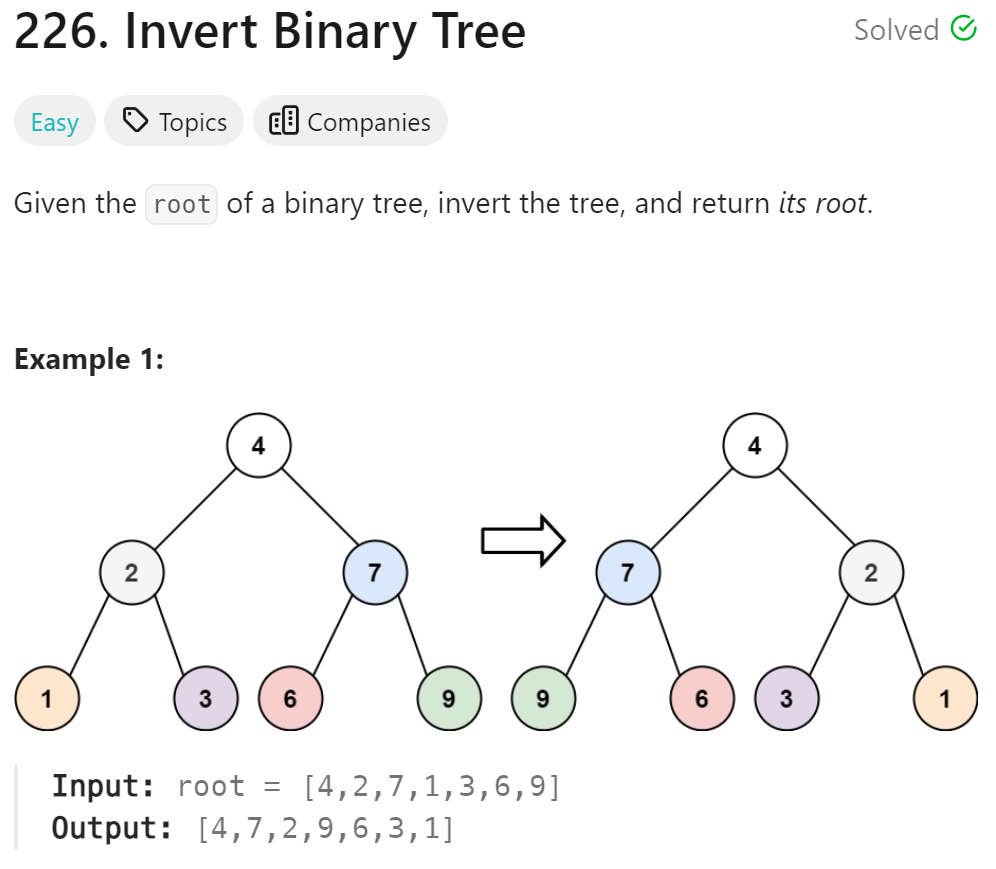

# 226. Invert Binary Tree


## 难点
使用层级遍历交换当前节点的左右子树。
需要注意的是，在定义TreeNode* left=nullptr,*right=nullptr的时候一定要写nullptr，
防止在下一个循环中，left和right沿用上个循环的结点，造成无限循环。
在C++中，指针的内存地址会沿用。

## C++
``` C++
TreeNode* invertTree(TreeNode* root) {
    if (root==nullptr) return root;
    queue<TreeNode*> que;
    que.push(root);
    while(!que.empty())
    {
        int size=que.size();
        for (int i=0;i<size;i++)
        {
            TreeNode* left=nullptr,*right=nullptr;
            TreeNode* cur=que.front();
            if (cur->right) 
            {
                right=cur->right;
                que.push(right);
            }
            if (cur->left) 
            {
                left=cur->left;
                que.push(left);
            }
            cur->left=right;
            cur->right=left;             
            que.pop();
        }
    }
    return root;
}
```

## Python
``` Python
def invertTree(self, root: Optional[TreeNode]) -> Optional[TreeNode]:
    que=deque()
    if not root:
        return root
    que.append(root)
    while que:
        size=len(que)
        for i in range(size):
            que[0].left,que[0].right =que[0].right, que[0].left
            if que[0].left:
                que.append(que[0].left)
            if que[0].right:
                que.append(que[0].right)
            que.popleft()
    return root
```