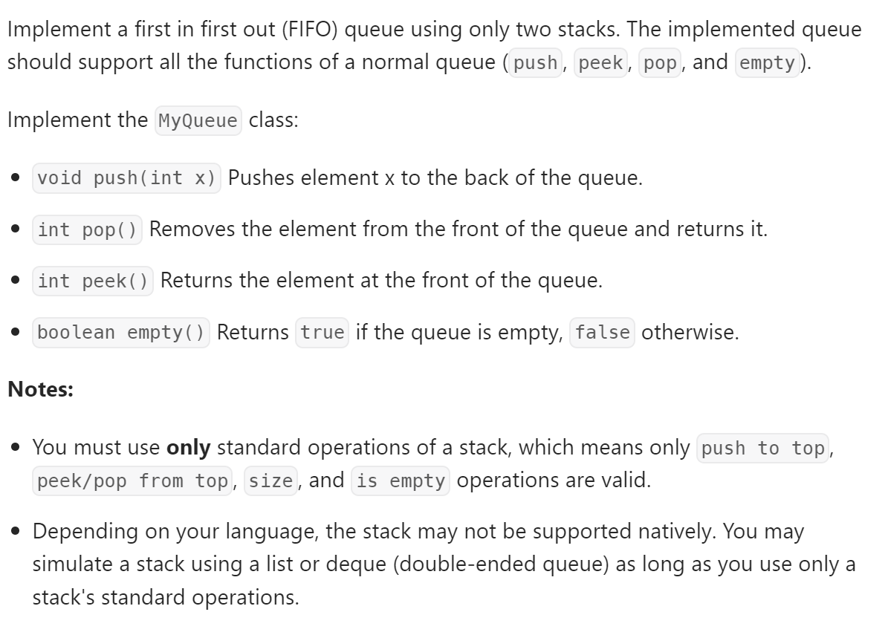

# 232 Implement Queue using Stacks


## 难点
本题考点在于pop和peek有很大一部分代码公用，所以要想办法把代码抽象出来，不要简单复制黏贴

## C++
``` C++
class MyQueue {
public:
    stack<int> s1;
    stack<int> s2;
    MyQueue() {
        
    }
    
    void push(int x) {
        s1.push(x);
    }
    
    int pop() {
        if (s2.empty())
        {
            int size=s1.size();
            while(size--)
            {
                s2.push(s1.top());
                s1.pop();
            }
        }
        int tmp=s2.top();
        s2.pop();
        return tmp;
    }
    
    int peek() {
        int ans=this->pop();
        s2.push(ans);
        return ans;
    }
    
    bool empty() {
        return s1.empty()&&s2.empty();
    }
};

/**
 * Your MyQueue object will be instantiated and called as such:
 * MyQueue* obj = new MyQueue();
 * obj->push(x);
 * int param_2 = obj->pop();
 * int param_3 = obj->peek();
 * bool param_4 = obj->empty();
 */
```

## Python
``` Python
class MyQueue:

    def __init__(self):
        self.s1=[]
        self.s2=[]

    def push(self, x: int) -> None:
        self.s1.append(x)

    def pop(self) -> int:
        if not self.s2:
            while self.s1:
                self.s2.append(self.s1.pop())
        return self.s2.pop()

    def peek(self) -> int:
        tmp=self.pop()
        self.s2.append(tmp)
        return tmp

    def empty(self) -> bool:
        return not self.s1 and not self.s2


# Your MyQueue object will be instantiated and called as such:
# obj = MyQueue()
# obj.push(x)
# param_2 = obj.pop()
# param_3 = obj.peek()
# param_4 = obj.empty()
```