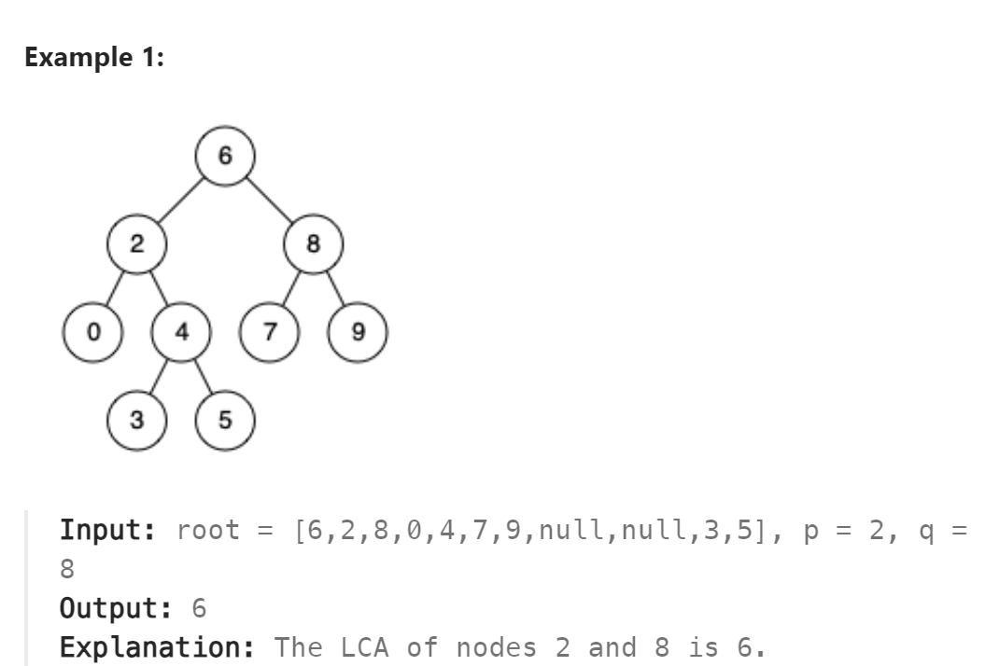

# 235. Lowest Common Ancestor of a Binary Search Tree



## 难点

## C++
``` C++
class Solution {
public:
    TreeNode* lowestCommonAncestor(TreeNode* root, TreeNode* p, TreeNode* q) {
        int maxn=max(p->val,q->val);
        int minn=min(p->val,q->val);
        if (root->val<=maxn&&root->val>=minn) return root;
        if (root->val<minn) return lowestCommonAncestor(root->right,p,q);
        else return lowestCommonAncestor(root->left,p,q);
    }
};
```

## Python
``` Python
class Solution:
    def lowestCommonAncestor(self, root: 'TreeNode', p: 'TreeNode', q: 'TreeNode') -> 'TreeNode':
        if root.val<p.val and root.val<q.val:
            return self.lowestCommonAncestor(root.right,p,q)
        elif root.val>p.val and root.val>q.val:
            return self.lowestCommonAncestor(root.left,p,q)
        else:
            return root
```