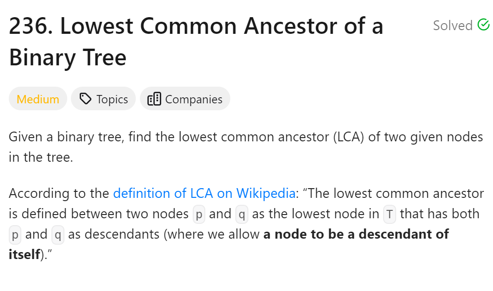
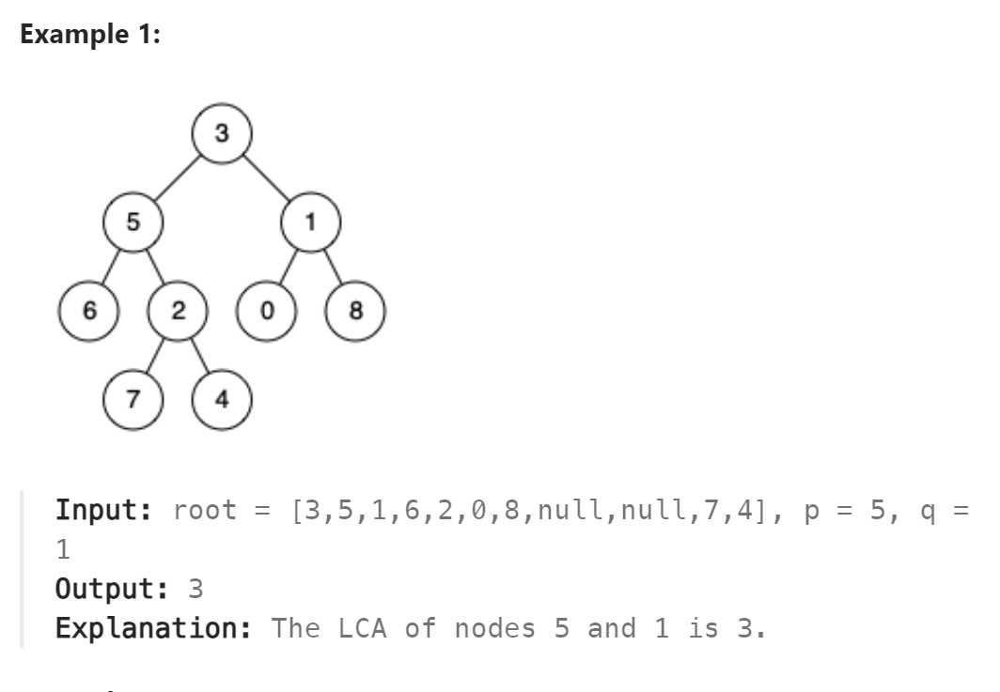

# 236. Lowest Common Ancestor of a Binary Tree



## 难点
本题难点在于对于返回值的处理，当我们遇到对应的结点的时候，直接向上返回当前结点。
第一种情况是左右都有返回值，则表明当前点是祖先点。
第二种情况是只有一边有返回值，则表明要么是已经找到祖先点在上传祖先点，要么是还没有找到，等待上层操作。
无论是哪种情况，都不妨碍继续上传当前有返回值的一边。
第三种情况是无返回值，说明没有找到，所以也返回nullptr。

## C++
``` C++
class Solution {
public:
    TreeNode* lowestCommonAncestor(TreeNode* root, TreeNode* p, TreeNode* q) {
        if (root==p||root==q||root==nullptr) return root;
        TreeNode* left=lowestCommonAncestor(root->left,p,q);
        TreeNode* right=lowestCommonAncestor(root->right,p,q);
        if (left&&!right) return left;
        else if (!left&&right) return right;
        else if (left&&right) return root;
        else return nullptr;
    }
};
```

## Python
``` Python
class Solution:
    def lowestCommonAncestor(self, root: 'TreeNode', p: 'TreeNode', q: 'TreeNode') -> 'TreeNode':
        if root==p or root==q or not root:
            return root
        left=self.lowestCommonAncestor(root.left,p,q)
        right=self.lowestCommonAncestor(root.right,p,q)
        if left and right:
            return root
        elif left and not right:
            return left
        elif not left and right:
            return right
        else:
            return None
```