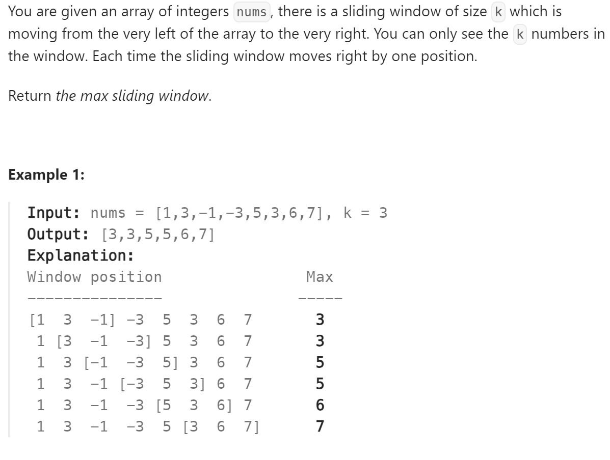

# 239 Sliding Window Maximum


## 难点
自主设计一个单调队列，队列头只维护当前窗口的最大值。通过pop来在向右滑动队列的过程中踢出最大值。通过push来确保加入进来的值都以单调递减的顺序排列，踢出不符合要求的元素。

## C++
``` C++
class MyQueue{
public:
    deque<int> que;

    void pop(int value)
    {
        if (!que.empty()&&que[0]==value)
            que.pop_front();
    }

    void push(int value)
    {
        while (!que.empty()&&que.back()<value)
        {
            que.pop_back();
        }
        que.push_back(value);
    }

    int getMax()
    {
        return que.front();
    }
};

vector<int> maxSlidingWindow(vector<int>& nums, int k) {
    MyQueue que;
    for (int i=0;i<k;i++)
        que.push(nums[i]);
    vector<int> ans;
    ans.push_back(que.getMax());
    for (int i=k;i<nums.size();i++)
    {
        que.pop(nums[i-k]);
        que.push(nums[i]);
        ans.push_back(que.getMax());
    }
    return ans;
}
```
