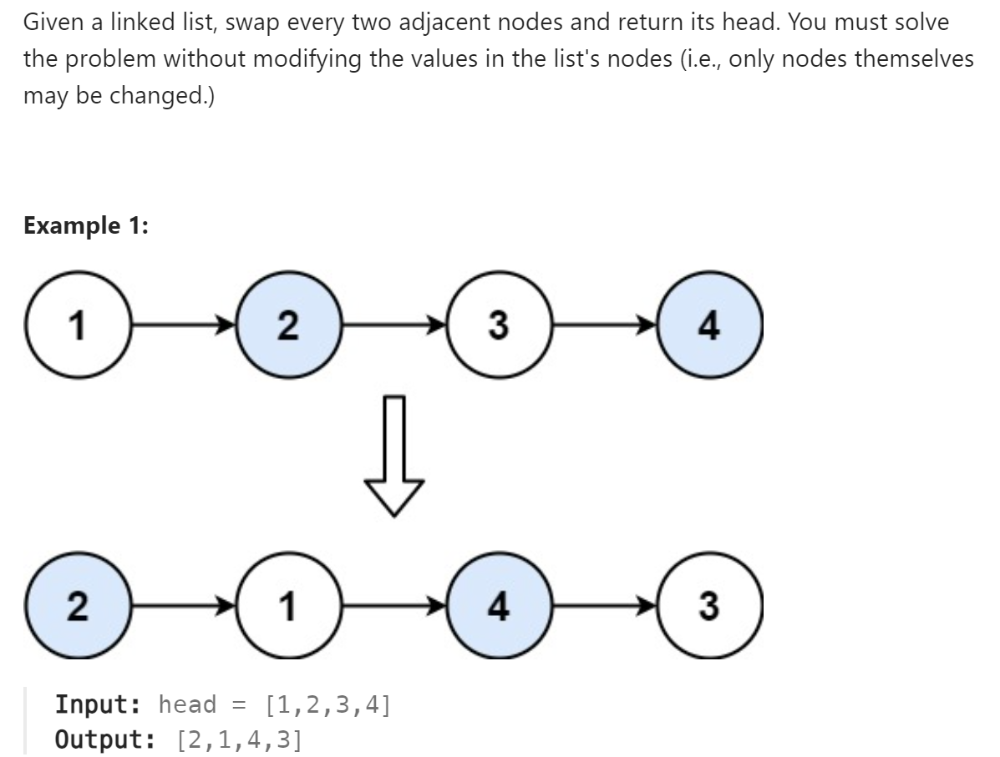

# 24 Swap Nodes in Pairs


# 难点
本题我添加了一个dummy head，用来更方便地swap，但是需要注意在C++中，新增得dummy head需要在结束时delete，防止内存泄漏

# C++
``` C++
/**
 * Definition for singly-linked list.
 * struct ListNode {
 *     int val;
 *     ListNode *next;
 *     ListNode() : val(0), next(nullptr) {}
 *     ListNode(int x) : val(x), next(nullptr) {}
 *     ListNode(int x, ListNode *next) : val(x), next(next) {}
 * };
 */
class Solution {
public:
    ListNode* swapPairs(ListNode* head) {
        if (head==nullptr||head->next==nullptr)
            return head;
        ListNode *Fhead=new ListNode(0,head);
        ListNode *pre=Fhead, *cur=head;
        while(cur!=nullptr&&cur->next!=nullptr)
        {
            ListNode *nextnode=cur->next;
            cur->next=nextnode->next;
            nextnode->next=cur;
            pre->next=nextnode;
            pre=cur;
            cur=cur->next;
        }
        cur=Fhead->next;
        delete Fhead;
        return cur;
    }
};
```

# Python
``` Python
# Definition for singly-linked list.
# class ListNode:
#     def __init__(self, val=0, next=None):
#         self.val = val
#         self.next = next
class Solution:
    def swapPairs(self, head: Optional[ListNode]) -> Optional[ListNode]:
        if head==None or head.next==None:
            return head
        Fhead=ListNode(0,head)
        pre, cur=Fhead, head
        while cur!=None and cur.next!=None:
            nextNode=cur.next
            cur.next=nextNode.next
            nextNode.next=cur
            pre.next=nextNode
            pre=cur
            cur=cur.next
        return Fhead.next
```