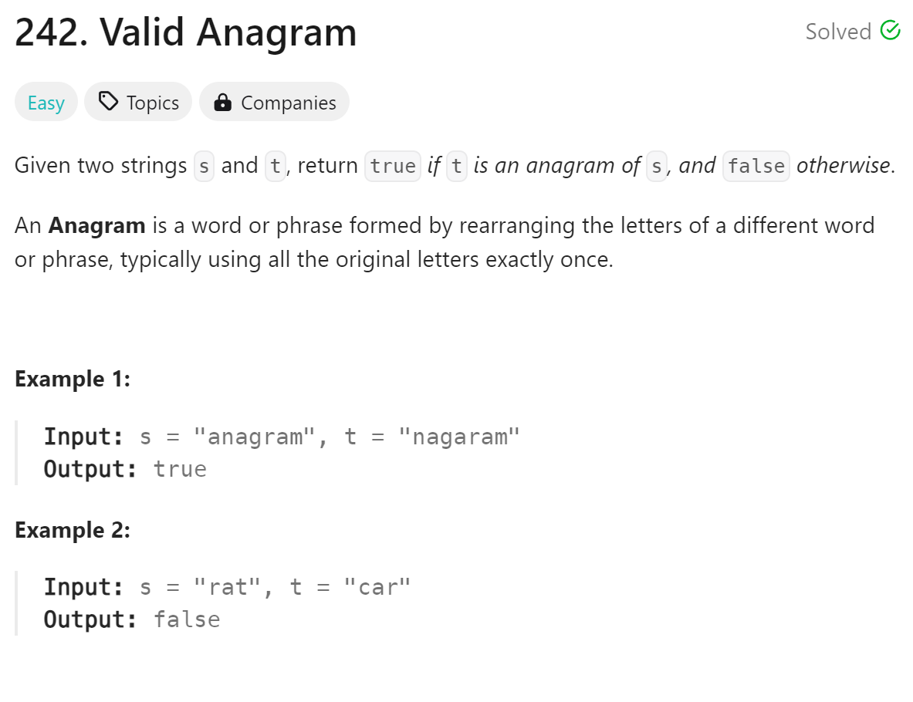

# 242 Valid Anagram


## 难点
本题难点在于unordered_map和dict的用法。两者的底层逻辑都是哈希表，便于查找。

## C++
``` C++
bool isAnagram(string s, string t) {
    if (s.size()!=t.size()) return false;
    unordered_map<char,int> countMap;
    for (char c:s)
    {
        countMap[c]++;
    }
    for (char c:t)
    {
        countMap[c]--;
        if (countMap[c]<0)
            return false;
    }
    return true;
}
```

## Python
``` Python
def isAnagram(self, s: str, t: str) -> bool:
    if len(s)!=len(t):
        return False
    
    countMap={}
    for c in s:
        if c in countMap:
            countMap[c]+=1
        else:
            countMap[c]=1
    for c in t:
        if c in countMap:
            countMap[c]-=1
            if countMap[c]<0:
                return False
        else:
            return False
    return True 
```