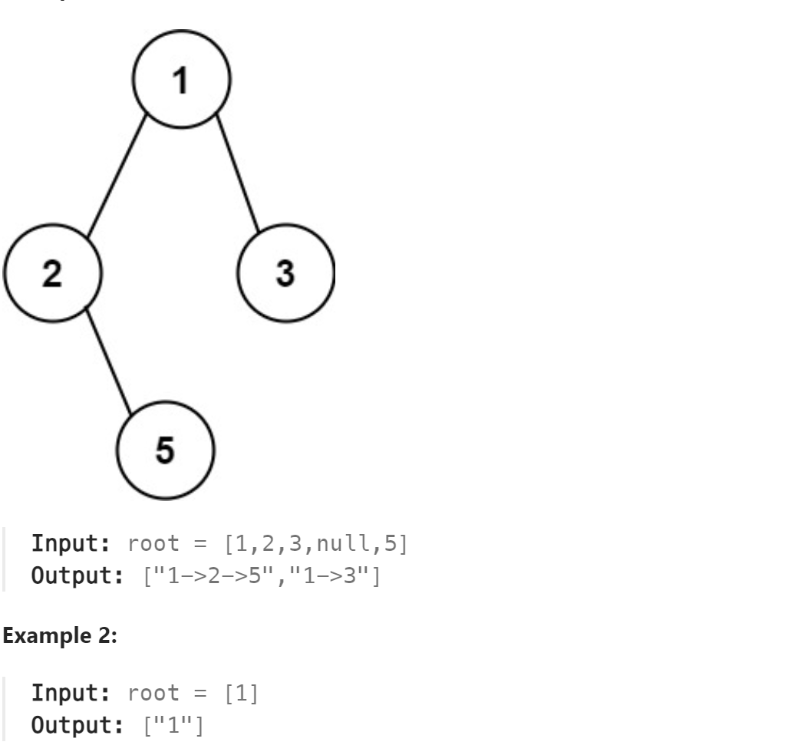

# 257. Binary Tree Paths



## 难点
本题难点在于需要使用回溯算法，在从下一次的递归回归的时候，需要把多出来的结点删除

## C++
``` C++
void traversal(TreeNode* cur,vector<int>& path, vector<string>& ans)
{
    path.push_back(cur->val);
    if (cur->left==nullptr&&cur->right==nullptr)
    {
        string SPath;
        SPath+=to_string(path[0]);
        for (int i=0;i<path.size()-1;i++)
        {
            SPath+="->";
            SPath+=to_string(path[i+1]);
        }
        ans.push_back(SPath);
        return;
    }
    if (cur->left)
    {
        traversal(cur->left,path,ans);
        path.pop_back();
    }
    if (cur->right)
    {
        traversal(cur->right,path,ans);
        path.pop_back();
    }
}

vector<string> binaryTreePaths(TreeNode* root) {
    vector<string> ans;
    vector<int> path;
    if (root==nullptr) return ans;
    traversal(root,path,ans);
    return ans;
}
```

## Python
``` Python
def traversal(self,cur,path,ans):
    path.append(cur.val)
    if not cur.left and not cur.right:
        SPath=str(path[0])
        for i in range(1,len(path)):
            SPath+="->"+str(path[i])
        ans.append(SPath)
        return
    if cur.left:
        self.traversal(cur.left,path,ans)
        path.pop()
    if cur.right:
        self.traversal(cur.right,path,ans)
        path.pop()

def binaryTreePaths(self, root: Optional[TreeNode]) -> List[str]:
    ans=[]
    path=[]
    if not root:
        return ans
    self.traversal(root,path,ans)
    return ans
```