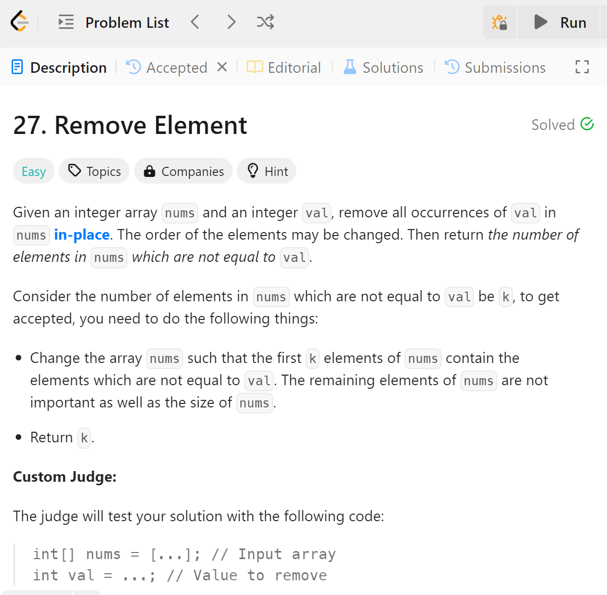
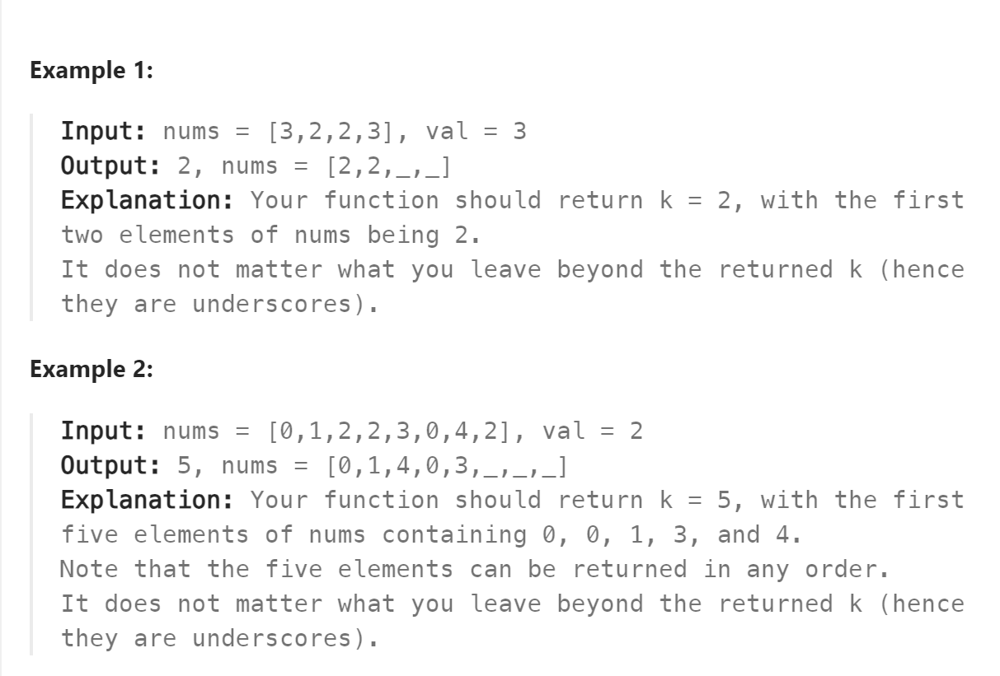

# 27 Remove Element


## 难点
难点在于如何降低时间复杂度，本做法让k作为不被消除的数字的计数器，同时也作为定位器，让对于每一个不需要被消除数字前移到合适的位置

## C++
``` C++
int removeElement(vector<int>& nums, int val) {
    if (nums.size()==0) return 0;
    int k=0;
    for (int i=0;i<nums.size();i++)
    {
        if (nums[i]!=val)
        {
            nums[k]=nums[i];
            k++;
        }
    }
    return k;
}
```

## Python
``` python
def removeElement(self, nums: List[int], val: int) -> int:
    k=0
    for i in range(len(nums)):
        if nums[i]!=val:
            nums[k]=nums[i]
            k=k+1
    return k
```