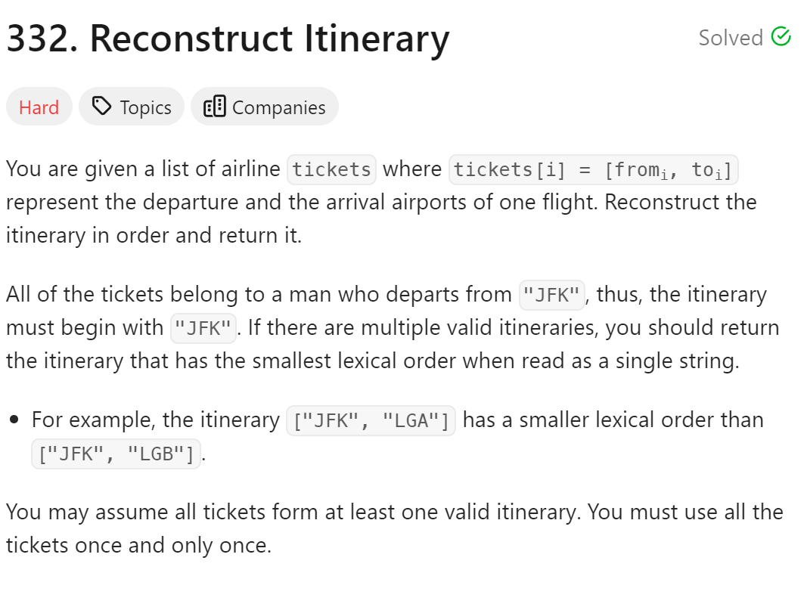

# 332. Reconstruct Itinerary



## 难点
选择合适的容器来装数据，用unordered_map来表现起始点和多个目的地之间的映射，
用map来表现当前起始点和目的地之间还有几次飞行机会
而且map由于其自动排序的功能，自动实现了对string的字母排序

## C++
``` C++
class Solution {
public:
    unordered_map<string,map<string,int>> target;
    vector<string> ans;
    bool backtracking(int size)
    {
        if (ans.size()==size+1)
            return true;
        for (pair<const string,int>& t:target[ans[ans.size()-1]])
        {
            if (t.second<=0) continue;
            ans.push_back(t.first);
            t.second--;
            if (backtracking(size)) return true;
            t.second++;
            ans.pop_back();
        }
        return false;
    }

    vector<string> findItinerary(vector<vector<string>>& tickets) {
        target.clear();
        for (vector<string>& s:tickets)
        {
            target[s[0]][s[1]]++;
        }
        ans.push_back("JFK");
        backtracking(tickets.size());
        return ans;
    }
};
```