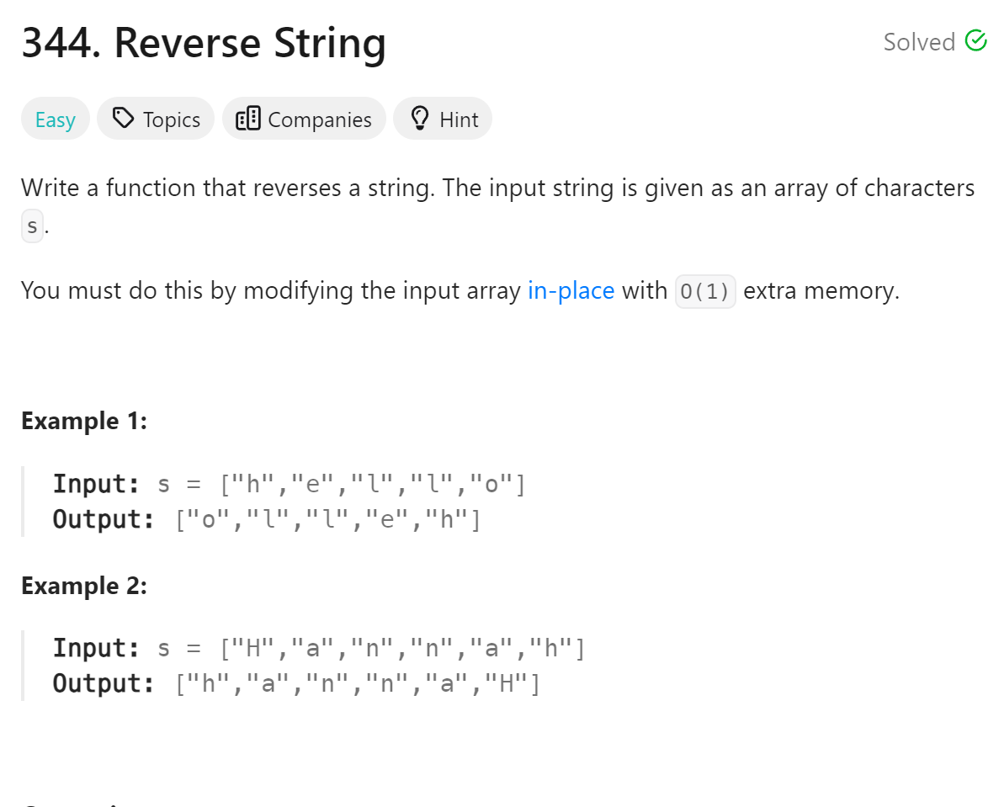

# 344 Reverse String


## 难点
无难点

## C++
``` C++
void reverseString(vector<char>& s) {
    int right=s.size()-1;
    int left=0;
    while(left<right)
    {
        char tmp=s[left];
        s[left]=s[right];
        s[right]=tmp;
        left++;
        right--;
    }
}
```

## Python
``` Python
def reverseString(self, s: List[str]) -> None:
    """
    Do not return anything, modify s in-place instead.
    """
    for i in range(len(s)//2):
        s[i],s[len(s)-i-1]=s[len(s)-i-1],s[i]
```