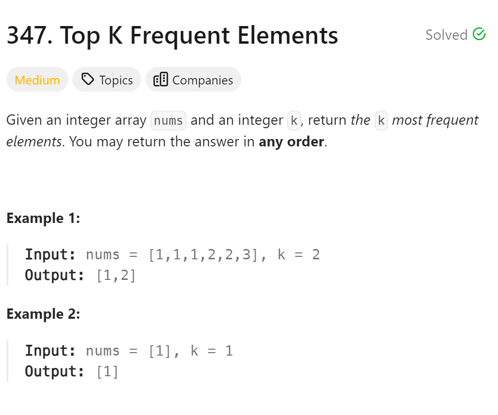

# 347 Top K Frequent Elements


## 难点
本题难点在于小顶堆的实现，以及pair的使用，遍历器的使用

## C++
``` C++
class myComparison {
public:
    bool operator()(const pair<int, int>& lhs, const pair<int, int>& rhs) {
        return lhs.second > rhs.second;
    }
};

vector<int> topKFrequent(vector<int>& nums, int k) {
    unordered_map<int, int> mymap;
    for (int i = 0; i < nums.size(); i++)
        mymap[nums[i]]++;

    priority_queue<pair<int, int>, vector<pair<int,int>>, myComparison> pque;
    for (unordered_map<int, int>::iterator it = mymap.begin();
    it != mymap.end();it++)
    {
        pque.push(*it);
        if (pque.size()>k)
            pque.pop();
    }
    vector<int> ans(k);
    for (int i=k-1;i>=0;i--)
    {
        ans[i]=pque.top().first;
        pque.pop();
    }
    return ans;
}
```

## Python
``` Python
def topKFrequent(self, nums: List[int], k: int) -> List[int]:
    mymap={}
    for i in range(len(nums)):
        mymap[nums[i]]=mymap.get(nums[i],0)+1
    
    heap=[]
    for key,freq in mymap.items():
        heapq.heappush(heap,(freq,key))
        if len(heap)>k:
            heapq.heappop(heap)
    ans=[0]*k
    for i in range(k-1,-1,-1):
        ans[i]=heapq.heappop(heap)[1]
    return ans
```