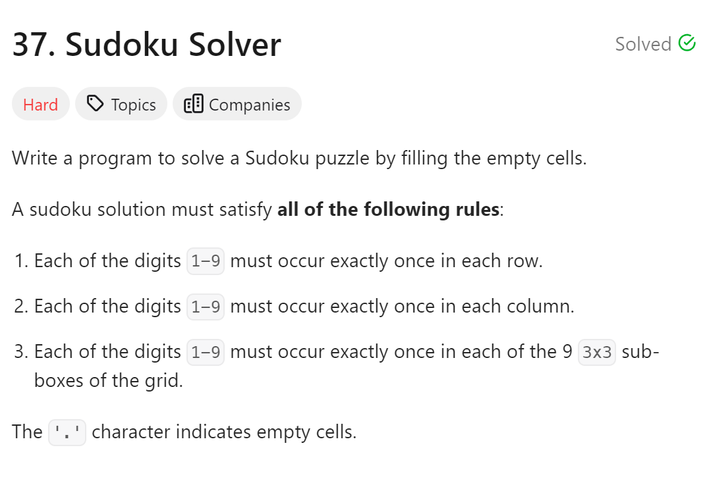
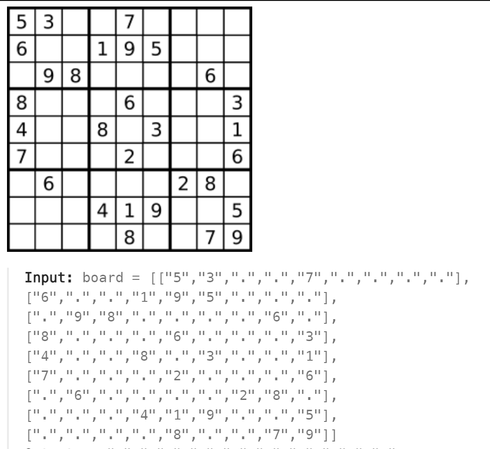
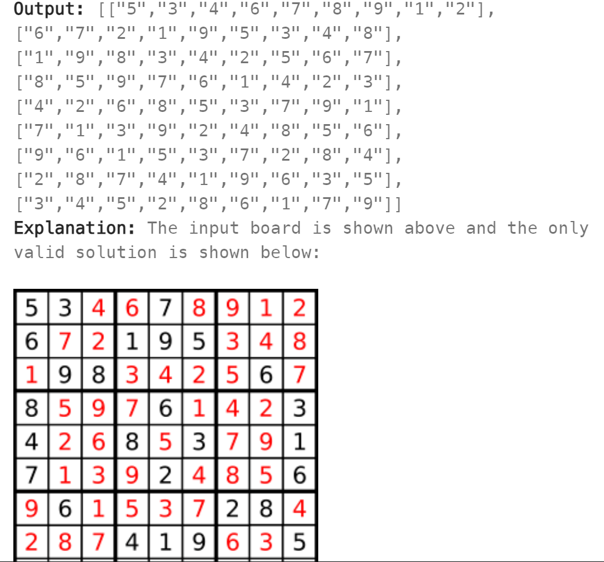

# 37. Sudoku Solver




## 难点
将回溯问题从一维问题延申成二维问题，需要对整个棋盘作遍历

## C++
``` C++
class Solution {
public:
    bool backtracking(vector<vector<char>>& board)
    {
        for (int i=0;i<board.size();i++)
        {
            for (int j=0;j<board.size();j++)
            {
                if (board[i][j]!='.') continue;
                for (char k='1';k<='9';k++)
                {
                    if (!isValid(board,i,j,k))
                        continue;
                    board[i][j]=k;
                    if (backtracking(board)) return true;
                    board[i][j]='.';
                }
                return false;
            }
        }
        return true;
    }

    bool isValid(vector<vector<char>>& board, int i, int j, char k)
    {
        for (int row=0;row<board.size();row++)
        {
            if (board[row][j]==k) return false;
        }
        for (int col=0;col<board.size();col++)
        {
            if (board[i][col]==k) return false;
        }
        int startrow=(i/3)*3,startcol=(j/3)*3;
        for (int row=startrow;row<startrow+3;row++)
            for (int col=startcol;col<startcol+3;col++)
                if (board[row][col]==k) return false;
        return true;
    }

    void solveSudoku(vector<vector<char>>& board) {
        backtracking(board);
    }
};
```
