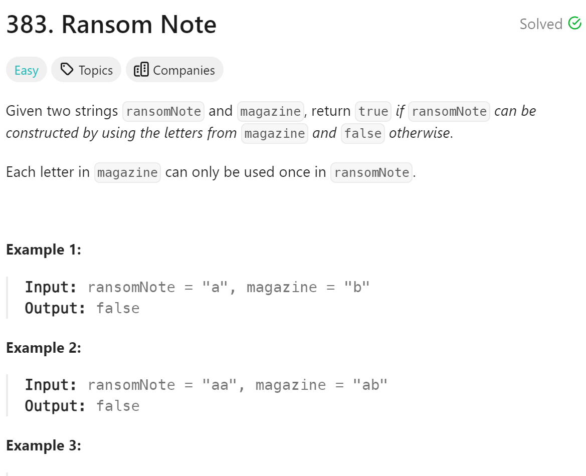

# 383 Ransom Note


## 难点
用hashmap对每个字母计数

## C++
``` C++
bool canConstruct(string ransomNote, string magazine) {
    unordered_map<char, int> map;
    for (char c: magazine)
    {
        map[c]++;
    }
    for (char c:ransomNote)
    {
        map[c]--;
        if (map[c]<0) return false;
    }
    return true;
}
```

## Python
``` Python
def canConstruct(self, ransomNote: str, magazine: str) -> bool:
    map={}
    for ch in magazine:
        if ch in map:
            map[ch]+=1
        else:
            map[ch]=1
    for ch in ransomNote:
        if ch in map:
            map[ch]-=1
        else:
            return False
        if map[ch]<0:
            return False
    return True
```