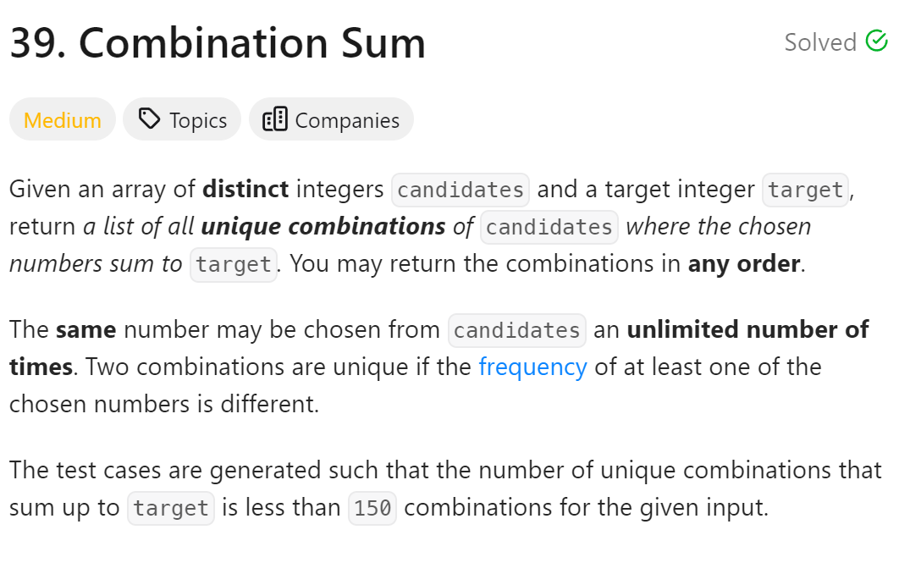
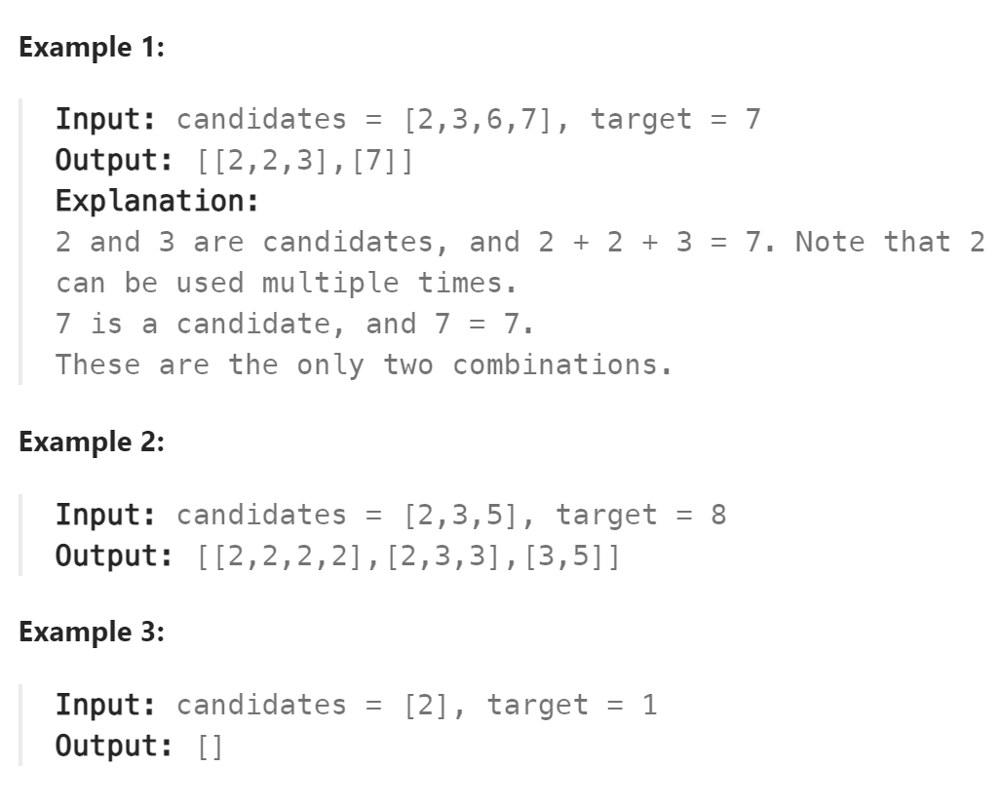

# 39. Combination Sum



## 难点

## C++
``` C++
class Solution {
public:
    void backtracking(vector<int>& cans, int target, vector<int>&path,
    vector<vector<int>>& ans,int& sum,int startIndex)
    {
        if (sum>target) return;
        if (sum==target){
            ans.push_back(path);
            return;
        }
        for (int i=startIndex;i<cans.size();i++)
        {
            sum+=cans[i];
            path.push_back(cans[i]);
            backtracking(cans,target,path,ans,sum,i);
            sum-=cans[i];
            path.pop_back();
        }
    }

    vector<vector<int>> combinationSum(vector<int>& candidates, int target) {
        vector<int> path;
        vector<vector<int>> ans;
        int sum=0;
        backtracking(candidates,target,path,ans,sum,0);
        return ans;
    }
};
```

## Python
``` Python
class Solution:
    def backtracking(self,cans,target,path,ans,sum,startIndex):
        if sum>target:
            return
        if sum==target:
            ans.append(path[:])
            return
        for i in range(startIndex,len(cans)):
            sum+=cans[i]
            path.append(cans[i])
            self.backtracking(cans,target,path,ans,sum,i)
            path.pop()
            sum-=cans[i]

    def combinationSum(self, candidates: List[int], target: int) -> List[List[int]]:
        path=[]
        ans=[]
        self.backtracking(candidates,target,path,ans,0,0)
        return ans
```