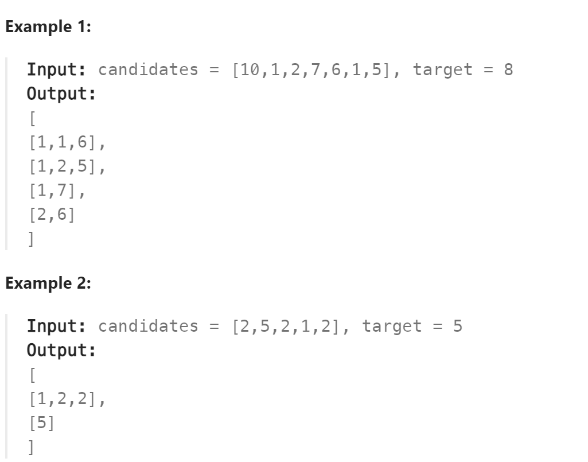

# 40. Combination Sum II



## 难点
本题的难点在于需要去重，去重首先要做的是排序，将一样的数字放在一起。
然后利用used数组实现树层之间的去重。
因为相同数字更靠前的那个，它的组合已经包含了靠后的数字的所有组合。
为了防止重复，利用used数组查看前一个数字的used是否为0，
若为0，则说明靠前的数字在同一层中已经使用过，去重。
若不为0，则说明两者不冲突，当前的数字是前一个相同数字的树枝。不去重

## C++
``` C++
class Solution {
public:
    void backtracking(vector<int>& cans, int target, vector<int>&path,
    vector<vector<int>>& ans,int& sum,int startIndex,vector<bool>& used)
    {
        if (sum>target) return;
        if (sum==target){
            ans.push_back(path);
            return;
        }
        for (int i=startIndex;i<cans.size();i++)
        {
            if (i>0&&cans[i]==cans[i-1]&&used[i-1]==false)
                continue;
            sum+=cans[i];
            path.push_back(cans[i]);
            used[i]=true;
            backtracking(cans,target,path,ans,sum,i+1,used);
            sum-=cans[i];
            path.pop_back();
            used[i]=false;
        }
    }

    vector<vector<int>> combinationSum2(vector<int>& candidates, int target) {
        vector<int> path;
        vector<vector<int>> ans;
        int sum=0;
        sort(candidates.begin(),candidates.end());
        vector<bool> used(candidates.size(),false);
        backtracking(candidates,target,path,ans,sum,0,used);
        return ans;
    }
};
```

